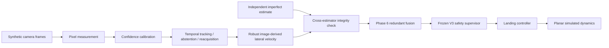

<div align="center">

# AegisLand

### Redundant Perception Safety for Simulated Autonomous UAV Landing

> **When one perception stream is confidently wrong, can independent evidence keep the system from acting on the error?**

[](https://github.com/suhaslord/uav-safety-research/actions/workflows/ci.yml)


**A reproducible simulation study of uncertainty, persistent perception bias, temporal image perception, redundant estimation, and safety–availability tradeoffs.**

</div>

---

## Phase 6: pixels → temporal perception → Aegis

AegisLand now includes a complete synthetic image-sequence perception path rather than relying only on directly corrupted state variables.



### Frozen held-out image result

The Phase 6 algorithm was frozen before evaluation. The held-out test used **100 paired episodes per image condition / architecture cell**, for **1,000 simulated landing episodes** total.

| Image condition | Image-only success | Image-only unsafe | **Image + Aegis success** | **Image + Aegis unsafe** | Aegis abort |
|---|---:|---:|---:|---:|---:|
| clean | 100% | 0% | **100%** | **0%** | 0% |
| blur | 100% | 0% | **100%** | **0%** | 0% |
| low light | 100% | 0% | **100%** | **0%** | 0% |
| occlusion | 89% | 11% | **96%** | **4%** | 0% |
| **mixed** | **63%** | **37%** | **92%** | **7%** | **1%** |

For held-out `mixed` image degradation, redundant Aegis supervision improved success by **29 percentage points** and reduced unsafe touchdowns by **30 percentage points** relative to the same temporal image-perception system without Aegis.

Paired episodes showed:

- **33** mixed image-only unsafe touchdowns became Aegis successes
- **3** mixed image-only successes became Aegis unsafe touchdowns
- **11** occlusion image-only unsafe touchdowns became Aegis successes
- **4** occlusion image-only successes became Aegis unsafe touchdowns

Full Phase 6 result: [`docs/phase6_results.md`](docs/phase6_results.md)  
Freeze protocol: [`docs/phase6_freeze.md`](docs/phase6_freeze.md)  
Architecture: [`docs/phase6_design.md`](docs/phase6_design.md)

> **Important negative result:** frame-level abstention is still weakly selective under the hardest synthetic degradation. The held-out system-level gain comes from the combined temporal + robust-velocity + redundant-integrity architecture, not from an abstention classifier that catches every bad frame.

> **Scope:** all Phase 6 results are synthetic-image, planar-simulation results. They are not physical-aircraft safety claims.

---

## Frozen V3 result

Before the image-based extension, the held-out V3 benchmark used **500 paired episode seeds per profile/architecture cell**, for **10,000 simulated landing episodes** total.

| Profile | Baseline unsafe | V2 unsafe | **V3 unsafe** | **V3 success** | V3 abort |
|---|---:|---:|---:|---:|---:|
| clean | 0.0% | 0.0% | **0.0%** | **100.0%** | 0.0% |
| blur | 0.0% | 0.0% | **0.0%** | **100.0%** | 0.0% |
| low light | 0.0% | 0.2% | **0.0%** | **100.0%** | 0.0% |
| occlusion | 34.6% | 33.6% | **1.4%** | **98.6%** | 0.0% |
| **mixed** | **84.2%** | **84.0%** | **2.4%** | **97.6%** | **0.0%** |

Under the primary abstract `mixed` stress profile, V3 reduced the observed unsafe-touchdown rate by **81.8 percentage points** versus baseline, approximately **97.1% relative** in this simulation.

### 95% Wilson intervals for V3

- `mixed` success: **95.85%–98.62%**
- `mixed` unsafe touchdown: **1.38%–4.15%**
- `occlusion` success: **97.14%–99.32%**
- `occlusion` unsafe touchdown: **0.68%–2.86%**

Full V3 results: [`docs/v3_results.md`](docs/v3_results.md)  
Raw committed outputs: [`results/v3_frozen/`](results/v3_frozen/)

---

## The research story

AegisLand was intentionally developed through measured failures instead of deleting old results when they looked bad.

| Stage | Main idea | What the experiment taught us |
|---|---|---|
| **Baseline** | always continue landing | easy conditions are fine; severe bias/noise causes unsafe touchdowns |
| **V1** | static confidence/risk thresholds | safety can improve by simply becoming unusably conservative |
| **V2** | temporal filtering + persistence + hysteresis | availability recovers, but persistent bias remains unidentifiable from one stream |
| **V3** | independent redundant estimate + bias-aware fusion | redundant evidence strongly reduces persistent-bias failures in held-out abstract-perception simulation |
| **Phase 5** | post-freeze robustness stress tests | V3 generalizes across seed families and stress axes, but reference quality matters |
| **Phase 6** | actual synthetic pixel sequences | temporal perception works, but smoothly wrong image tracks require cross-estimator integrity checks; standalone abstention remains a limitation |

That progression changed the project from threshold tuning into an **observability and selective-reliability problem**:

> If a sensor stream is internally consistent but wrong, what independent evidence is needed to recognize and safely handle the error?

---

## V3 / Phase 6 safety architecture

The independent reference estimate is intentionally imperfect:

- lower update rate than the primary perception stream
- independent zero-mean noise
- missed updates
- uncertainty growth between updates
- isolated RNG stream

Phase 6 adds a confidence-aware adapter so a good image track is not unnecessarily corrupted by noisy reference blending. Near simulated touchdown, strong image/reference disagreement can instead activate a temporary integrity fallback.

The system therefore does **not** get perfect ground truth as a controller input.

---

## Reproducibility safeguards

- deterministic top-level seeds
- paired architecture comparisons
- isolated environment, image, and reference RNG streams
- separate calibration, development, and frozen evaluation seeds
- explicit algorithm freeze before held-out evaluation
- full configuration snapshot in Phase 6 result metadata
- 95% Wilson intervals
- paired rescue/regression analysis
- touchdown failure decomposition
- calibration reliability / ECE audit
- automated frozen-result validators
- unit tests + compile checks
- GitHub Actions CI
- historical negative results retained
- explicit safety and external-validity limitations

See:

- [`docs/reproducibility.md`](docs/reproducibility.md)
- [`docs/v3_freeze.md`](docs/v3_freeze.md)
- [`docs/v3_results.md`](docs/v3_results.md)
- [`docs/phase5_results.md`](docs/phase5_results.md)
- [`docs/phase6_evaluation_protocol.md`](docs/phase6_evaluation_protocol.md)
- [`docs/phase6_freeze.md`](docs/phase6_freeze.md)
- [`docs/phase6_results.md`](docs/phase6_results.md)

---

## Reproduce the project

```bash
git clone https://github.com/suhaslord/uav-safety-research.git
cd uav-safety-research
python -m venv .venv
```

Activate the environment, then:

```bash
pip install -e ".[dev]"
pytest -q
```

### Reproduce frozen V3

```bash
python scripts/run_v3_comparison.py --episodes 500 --seed 424242 --out results/v3_frozen
python scripts/validate_v3_frozen.py --out results/v3_frozen --seed 424242 --episodes 500
```

### Reproduce frozen Phase 6 image evaluation

```bash
python scripts/run_phase6_image_landing.py \
  --episodes 100 \
  --seed 747474 \
  --calibration-seed 616161 \
  --calibration-samples 180 \
  --severity 1.0 \
  --run-role frozen \
  --out results/phase6_frozen
```

Then validate:

```bash
python scripts/validate_phase6_frozen.py \
  --out results/phase6_frozen \
  --seed 747474 \
  --episodes 100 \
  --calibration-seed 616161
```

Expected validator summary begins with:

```text
Phase 6 frozen validation: PASS
```

---

## Repository map

```text
uav-safety-research/
├── src/uav_safety/
│   ├── dynamics.py
│   ├── perception.py
│   ├── image_perception.py
│   ├── image_temporal.py
│   ├── phase6_velocity.py
│   ├── phase6_fusion.py
│   ├── controller.py
│   ├── supervisor.py
│   ├── supervisor_v2.py
│   ├── supervisor_v3.py
│   ├── reference_estimator.py
│   ├── simulator.py
│   ├── simulator_v2.py
│   ├── simulator_v3.py
│   ├── simulator_image_v3.py
│   └── metrics.py
├── scripts/
│   ├── run_experiments.py
│   ├── run_threshold_sweep.py
│   ├── run_v2_comparison.py
│   ├── run_v3_comparison.py
│   ├── validate_v3_frozen.py
│   ├── run_robustness_suite.py
│   ├── run_image_perception_benchmark.py
│   ├── run_phase6_image_landing.py
│   ├── run_phase6_selective_perception.py
│   ├── analyze_phase6_failures.py
│   └── validate_phase6_frozen.py
├── results/
│   ├── threshold_sweep/
│   ├── v2_comparison/
│   ├── v3_development/
│   └── v3_frozen/
├── tests/
├── docs/
└── paper/
```

---

## Current limitations

The results are strong **inside these simulations**, but external validity remains limited.

Current limitations include:

- planar dynamics rather than a full 6-DOF aircraft model
- synthetic imagery rather than calibrated real-camera data
- synthetic degradation rather than measured sensor physics
- abstract independent reference estimator rather than a modeled physical sensor
- no common-mode / correlated sensor-failure study yet
- frame-level abstention target is poorly aligned with some downstream landing outcomes
- weak bad-frame abstention recall under held-out mixed image sequences
- synthetic wind/disturbance field
- no hardware or physical-flight validation

The next research step should attack those limitations rather than retune the frozen Phase 6 numbers.

---

## Paper workspace

A result-grounded V3 abstract is available at [`paper/abstract.md`](paper/abstract.md). Phase 6 now provides the next major methods/results section for the manuscript.

---

## Safety scope

**AegisLand is not flight-control software.**

It is an educational, simulation-only research project. It is not validated for physical aircraft and should not be used to operate one.

---

## Author

**Suhas Beemineni**  
River Islands High School

Interested in aerospace engineering, autonomous systems, AI reliability, computational engineering, and research.

Technical criticism, methodology review, and reproducibility feedback are welcome.
