<div align="center">

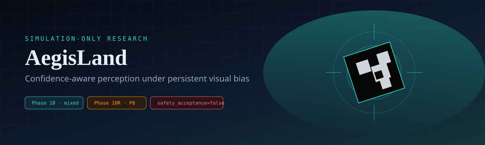

### When vision looks right — and still is wrong

[](https://github.com/suhaslord/uav-safety-research/actions/workflows/ci.yml)


**A simulation research program on perception overconfidence, calibrated abstention, redundant estimation, and the limits of those ideas under real simulator evidence.**

> If visual perception is internally consistent but systematically wrong, can independent evidence expose the error without making landing unusably conservative?

<br/>

[](https://aegisland-research-cockpit.vercel.app/)

[Protocol](docs/phase10_temporal_metric_perception_protocol.md)
·
[Frozen Phase 10 result](docs/phase10_frozen_holdout_result.md)
·
[Phase 10R gate](docs/phase10r_preregistration.md)
·
[Forensics](docs/phase10r_holdout_forensics.md)

</div>

---

## Visual tour

| | |
|:---:|:---:|
| 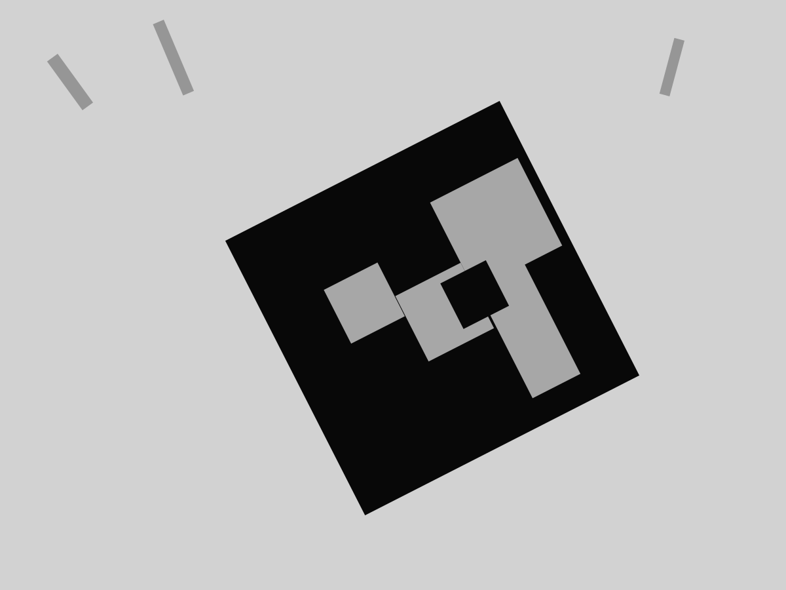 | 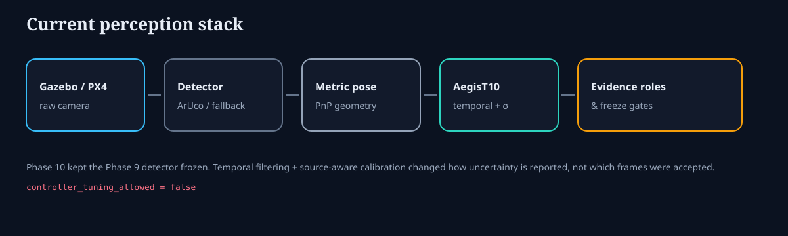 |
| **Landing-target motif** used across the Gazebo camera path | **Current stack** from raw camera → freeze gates |

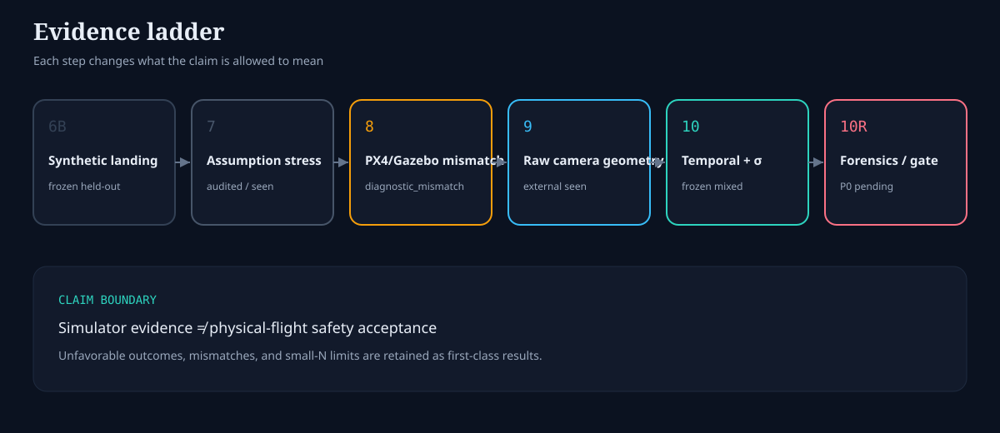

---

## Headline result — Phase 10 frozen holdout

Phase 10 froze a **mixed** Gazebo-camera result and left it alone.

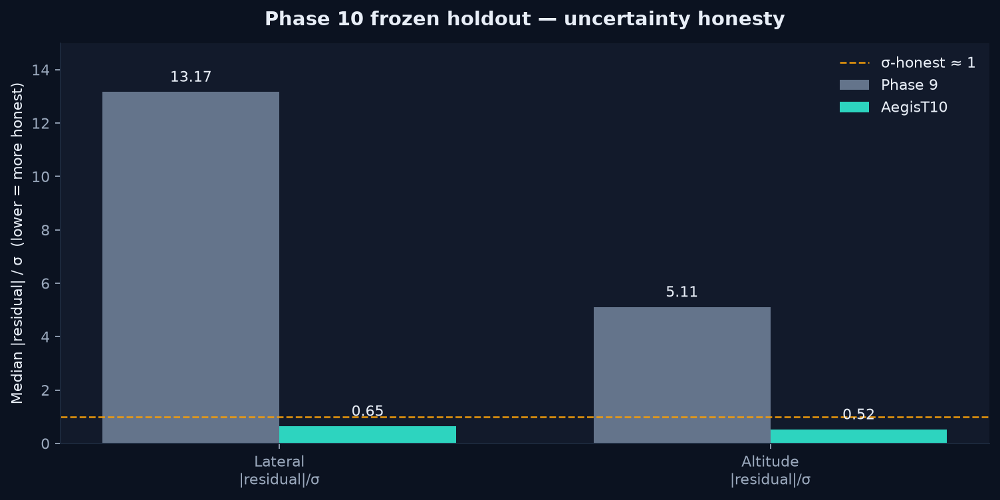

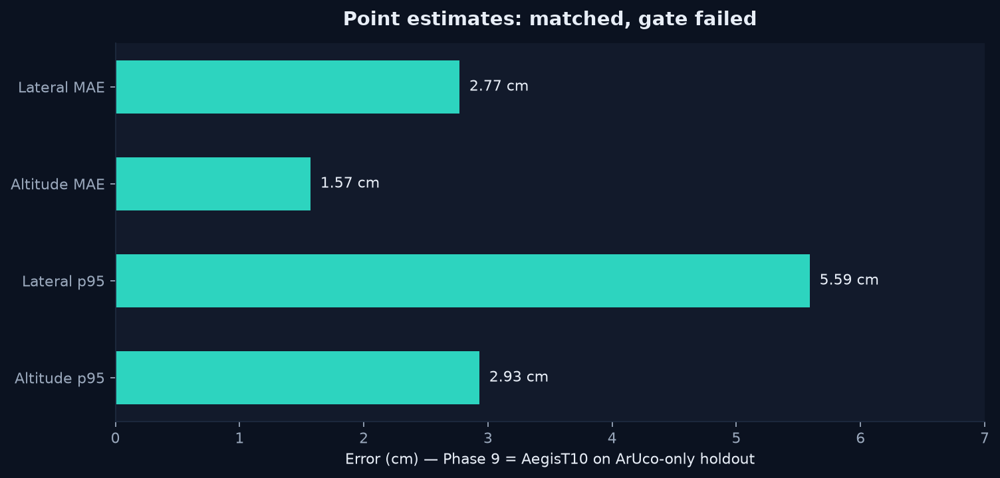

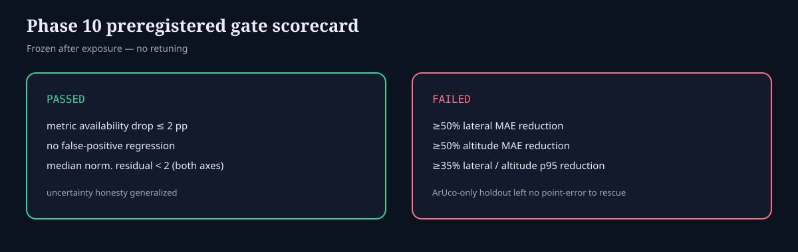

| Metric | Phase 9 | AegisT10 | Gate |
|---|---:|---:|:---|
| Lateral MAE | **2.77 cm** | **2.77 cm** | point-error win **failed** |
| Altitude MAE | **1.57 cm** | **1.57 cm** | point-error win **failed** |
| Median \|residual\| / σ (lateral) | 13.17 | **0.65** | uncertainty honesty **improved** |
| Median \|residual\| / σ (altitude) | 5.11 | **0.52** | uncertainty honesty **improved** |
| 2σ coverage | — | **93% / 100%** | calibrated uncertainty held |

### Why the temporal point-error win did not transfer

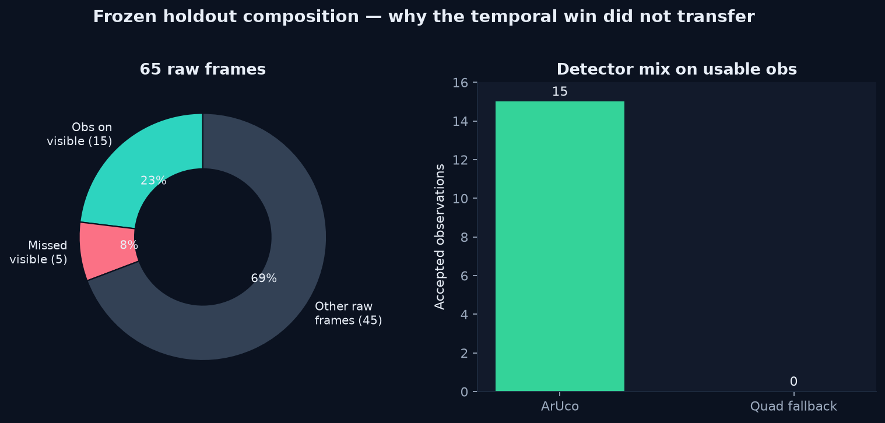

The holdout produced **15/15 ArUco** observations and **0** quad-fallback cases. Phase 9 geometry was already centimeter-accurate there, so temporal filtering had nothing catastrophic to rescue. The development win did not transfer — and that finding stayed in the record.

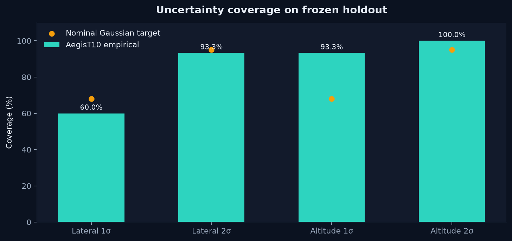

<details>
<summary><strong>Holdout provenance</strong></summary>

<br/>

- Evidence role: `phase10_holdout_unseen` → now historical for Phase 10R
- 65 raw frames · 20 truth-visible · 15 observations · 5 misses · 0 false positives
- Frozen implementation: `fb928d5b0d1fbee7459d55120d5fd6b232a4f2c6`
- Artifact digest: `sha256:ca47dd023ebb295c7318d5907ad725a88d3721c8f6d855d4490af9b77c7ee88d`
- Full write-up: [`docs/phase10_frozen_holdout_result.md`](docs/phase10_frozen_holdout_result.md)

</details>

---

## Phase 10R P0 — forensics without retuning

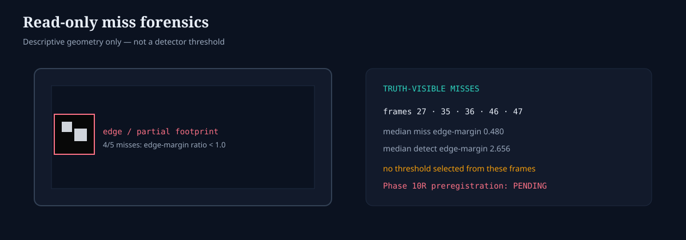

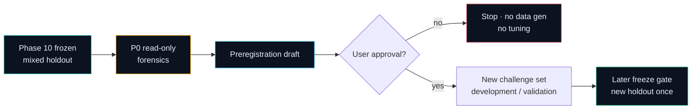

Until [`docs/phase10r_preregistration.md`](docs/phase10r_preregistration.md) is explicitly approved:

- no detector / pose / filter / calibration selection from miss frames `27, 35, 36, 46, 47`
- no challenge-development data generation
- no Phase 10R model selection

| Start here | Role |
|---|---|
| [Phase 10R preregistration](docs/phase10r_preregistration.md) | approval gate |
| [Holdout forensics](docs/phase10r_holdout_forensics.md) | read-only analysis |
| [Forensic analyzer](scripts/analyze_phase10_frozen_holdout.py) | hash-verified replay |
| [Live archive](https://aegisland-research-cockpit.vercel.app/) | visual case studies |

Current research branch: `phase10r1-p0-forensics-infrastructure`

---

## Earlier frozen milestones

### Phase 6B — selective confidence on synthetic landings

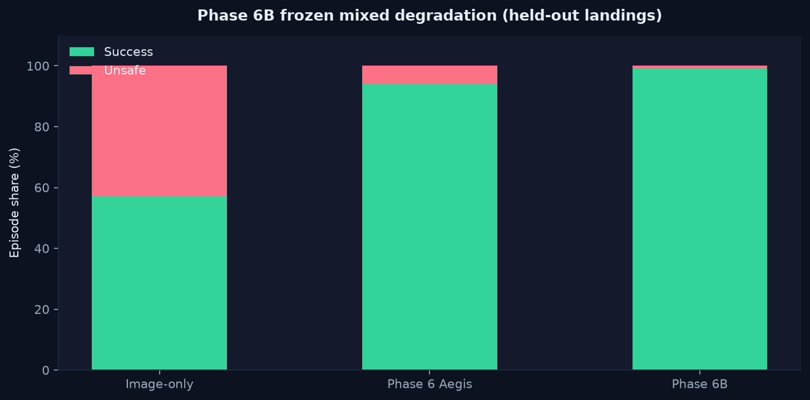

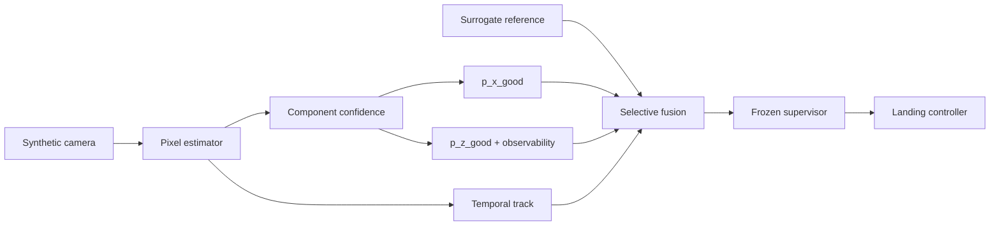

On mixed degradation (held-out): image-only **57% / 43%** unsafe → Phase 6B **99% / 1%** unsafe. Low-light kept a deliberate **3% timeout** cost.

### V3 — abstract redundant perception

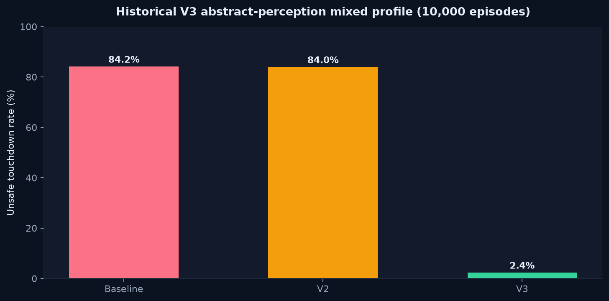

<p align="center">
  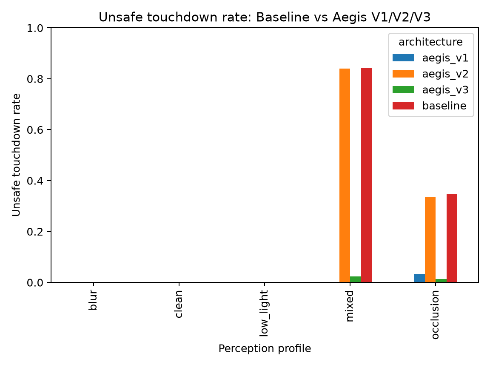
  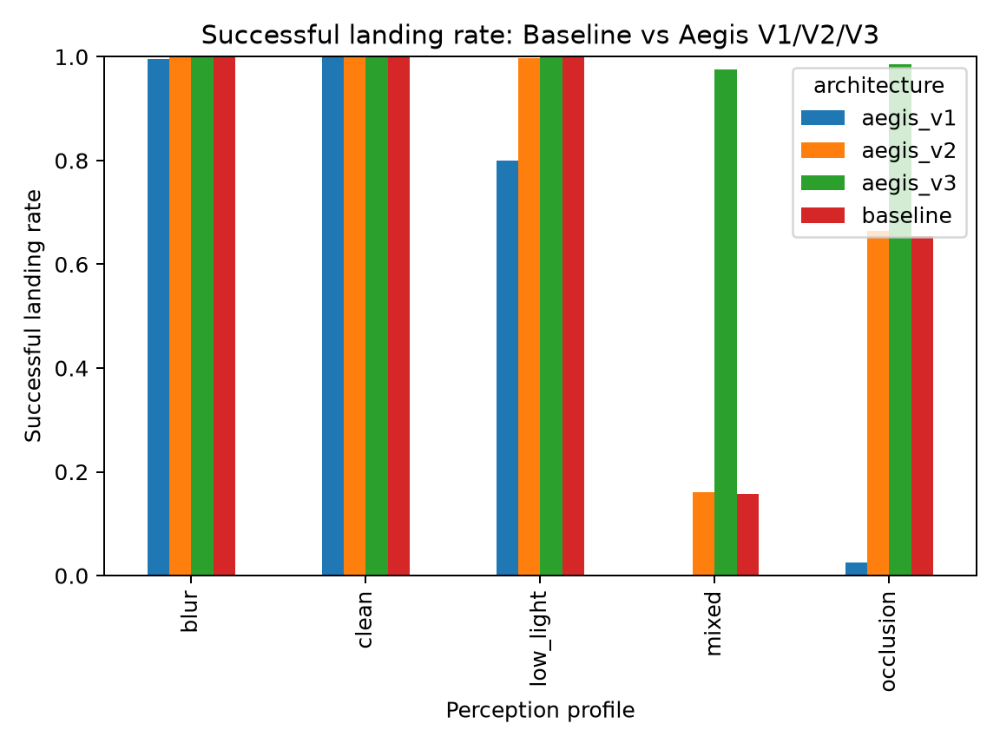
</p>

<p align="center">
  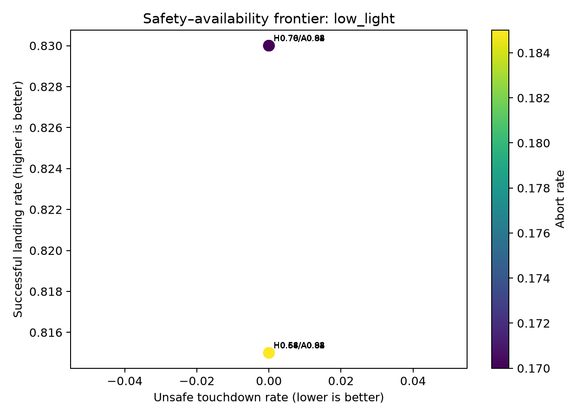
</p>

---

## Evidence chain

| Layer | Status | Supports |
|---|---|---|
| Phase 6B synthetic landing | **frozen held-out** | selective confidence on the defined synthetic benchmark |
| Phase 7 external-validity stress | **audited / seen** | where redundancy assumptions break |
| Phase 8 PX4/Gazebo traces | **external seen** | surrogate resemblance = `diagnostic_mismatch` |
| Phase 9 Gazebo camera | **external perception seen** | detection can look strong while metric geometry fails |
| Phase 10 temporal metric | **frozen holdout** | uncertainty improved; point-error gate failed |
| Phase 10R P0 | **forensics only** | miss decomposition + preregistration draft |
| Physical aircraft | **not tested** | no claim |

**Nothing here is a physical-flight safety acceptance.**  
`safety_acceptance = false` · `controller_tuning_allowed = false` · simulation only.

---

## Research lineage

| Stage | Idea | Lesson |
|---|---|---|
| V1 | fixed risk thresholds | safety via over-abort |
| V2 | temporal persistence | availability returns; single-stream bias remains |
| V3 | imperfect independent reference | independent error structure can expose persistent bias |
| Phase 5 | robustness sweeps | reference quality matters |
| Phase 6 / 6B | synthetic pixels + component confidence | reject bad altitude without discarding useful lateral cues |
| Phase 7–8 | assumption stress + external traces | common-mode faults and surrogate mismatch are first-class findings |
| Phase 9 | raw Gazebo camera | strong detection ≠ trustworthy metric geometry |
| Phase 10 | temporal metric + calibrated σ | honesty improved; preregistered point-error win failed |
| Phase 10R | generalization revision | forensics first, then new preregistered evidence |

---

## Quickstart

```bash
git clone https://github.com/suhaslord/uav-safety-research.git
cd uav-safety-research
git checkout phase10r1-p0-forensics-infrastructure
python -m venv .venv
source .venv/bin/activate
pip install -e ".[dev]"
pytest
```

```bash
python scripts/serve_dashboard.py
# → http://127.0.0.1:8765
```

Or open the hosted archive: [aegisland-research-cockpit.vercel.app](https://aegisland-research-cockpit.vercel.app/)

---

## Limitations

- Simulation only — **no** hardware-camera or physical-flight validation
- Phase 10 holdout is small: **20** truth-visible frames, **15** paired observations
- That holdout is now **seen** and cannot be a hidden Phase 10R test
- Phase 7 cells are development samples, not safety-rate estimates
- Phase 8 produced a genuine `diagnostic_mismatch` on a short external trace
- Passing CI does not imply UAV safety acceptance

---

## Safety scope

**AegisLand is not validated flight-control software.**

It is an educational, simulation-only research project. It must not be used to operate a physical aircraft.

---

<div align="center">

**Suhas Beemineni** · River Islands High School

Aerospace · autonomous systems · AI reliability · reproducible research

Technical criticism and methodology review are welcome.

</div>
