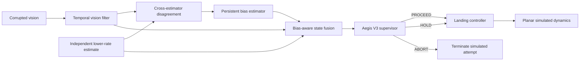

<div align="center">

# AegisLand

### Confidence-Aware Safety Supervision for Vision-Based Autonomous UAV Landing

> **When perception becomes unreliable, should an autonomous system keep acting on it?**

[](https://github.com/suhaslord/uav-safety-research/actions/workflows/ci.yml)


**A reproducible simulation research project on uncertainty, perception failure, and safety–availability tradeoffs.**

</div>

---

## Current research question

**Can independent, imperfect state evidence detect persistent visual bias and reduce unsafe simulated UAV touchdowns without returning to the excessive-abort behavior of earlier safety supervisors?**

AegisLand has evolved through measured failures rather than replacing old results:

| Version | Main idea | What the experiment taught us |
|---|---|---|
| **Baseline** | always continue landing | works in easy conditions, fails badly under severe bias/noise |
| **V1** | static confidence/risk thresholds | can reduce unsafe touchdowns, but often by aborting almost everything |
| **V2** | temporal filtering + persistence + hysteresis | fixes V1 over-conservatism, modestly helps occlusion, but cannot identify persistent bias |
| **V3** | independent redundant estimate + bias-aware fusion | **implemented; evaluation pending** |

No V3 performance claim is made until the frozen benchmark is run.

---

## Why V3 exists

The fixed 500-episode-per-cell V2 evaluation produced the clearest unresolved result:

| Profile | Baseline unsafe | V2 unsafe | Baseline success | V2 success |
|---|---:|---:|---:|---:|
| clean | 0.0% | 0.0% | 100.0% | 100.0% |
| blur | 0.0% | 0.0% | 100.0% | 100.0% |
| low light | 0.4% | 0.4% | 99.6% | 99.6% |
| occlusion | 33.8% | 30.6% | 66.2% | 69.4% |
| **mixed** | **84.2%** | **84.8%** | **15.8%** | **15.2%** |

V2 solved the excessive-abort problem but did **not** solve the persistent lateral bias in `mixed`.

That changed the research question from:

> “Can I tune the thresholds better?”

into:

> **“Does the system need another independent source of information to identify systematic bias?”**

See [`docs/v2_results.md`](docs/v2_results.md) and [`docs/v3_research_plan.md`](docs/v3_research_plan.md).

---

## V3 architecture



### Important design constraints

V3 does **not** receive perfect ground truth as a second controller input.

The independent reference estimate is intentionally imperfect:

- lower update rate than vision
- independent zero-mean noise
- missed updates
- uncertainty growth between updates
- separate RNG stream

The reference stream exists to test the value of **independent error structure**, not to make the problem artificially easy.

---

## What V3 changes

### Persistent-bias detection

V3 tracks lateral disagreement only when fresh independent evidence is available. A rolling estimator determines whether the offset is:

- persistent,
- large enough to matter, and
- statistically distinguishable from ordinary noise.

Strong correction is applied only when all three are true.

### Bias-aware fusion

The control estimate combines:

1. temporally filtered vision,
2. confidence-gated visual-bias correction,
3. a modest weight from the independent reference estimate.

The strongest redundant-estimator weight is applied to lateral position because that is the measured V2 failure mode.

### Explained vs unexplained disagreement

Persistent disagreement that can be explained by a stable bias estimate is treated differently from large disagreement that remains unexplained near touchdown.

That prevents the safety layer from turning every detectable bias into another V1-style abort cascade.

---

## Research-quality safeguards

AegisLand is built around reproducibility rather than a single impressive demo.

- deterministic top-level seeds
- paired architecture comparisons
- isolated V3 reference RNG
- raw episode-level CSV output
- 95% Wilson intervals
- paired-effect analysis
- threshold/architecture history preserved
- automated unit tests
- compile checks + CI smoke benchmark
- explicit limitations and safety scope

See [`docs/reproducibility.md`](docs/reproducibility.md).

---

## Quick start

```bash
git clone https://github.com/suhaslord/uav-safety-research.git
cd uav-safety-research
python -m venv .venv
```

Activate the environment, then:

```bash
pip install -e ".[dev]"
pytest -q
```

### V3 development comparison

```bash
python scripts/run_v3_comparison.py --episodes 30 --seed 3031 --out results/v3_development
```

### V3 frozen evaluation

Run this **only after the development result has been reviewed and the V3 configuration is frozen**:

```bash
python scripts/run_v3_comparison.py --episodes 500 --seed 424242 --out results/v3_frozen
```

That evaluates:

**5 profiles × 4 architectures × 500 paired episode seeds = 10,000 simulated episodes.**

Outputs include:

```text
episodes.csv
summary.csv
paired_effects.csv
summary.md
success_rate.png
unsafe_touchdown_rate.png
abort_rate.png
mean_interventions.png
run_metadata.json
```

---

## Experimental profiles

| Profile | Stressors | Purpose |
|---|---|---|
| `clean` | low noise | control condition |
| `blur` | moderate state noise | mild degradation |
| `low_light` | uncertainty + moderate bias | visibility-like stress surrogate |
| `occlusion` | dropout + noise + bias | partial-observation surrogate |
| `mixed` | strongest noise + dropout + persistent bias | primary V3 stress test |

These are **abstract simulation stress profiles**, not calibrated camera models.

---

## Primary V3 endpoint

**Unsafe touchdown rate under `mixed` degradation.**

Secondary checks:

- mixed success rate
- mixed abort rate
- clean/blur regression
- low-light availability
- occlusion unsafe-touchdown rate
- intervention count
- estimated lateral bias
- bias confidence
- paired episode rescues/regressions

A system that achieves zero unsafe touchdowns by aborting everything is **not** considered successful.

---

## Repository map

```text
uav-safety-research/
├── src/uav_safety/
│   ├── dynamics.py
│   ├── perception.py
│   ├── controller.py
│   ├── supervisor.py
│   ├── supervisor_v2.py
│   ├── supervisor_v3.py
│   ├── reference_estimator.py
│   ├── simulator.py
│   ├── simulator_v2.py
│   ├── simulator_v3.py
│   └── metrics.py
├── scripts/
│   ├── run_experiments.py
│   ├── run_threshold_sweep.py
│   ├── run_v2_comparison.py
│   └── run_v3_comparison.py
├── tests/
├── docs/
│   ├── research_plan.md
│   ├── methodology.md
│   ├── v1_findings_and_v2_plan.md
│   ├── v2_results.md
│   ├── v3_research_plan.md
│   ├── v3_design.md
│   ├── reproducibility.md
│   └── ethics_and_safety.md
└── paper/
```

---

## Scientific status

**V1:** fixed historical result  
**V2:** fixed historical result  
**V3:** implementation complete; benchmark pending

Negative results are part of the project. New versions do not overwrite old ones.

---

## Safety scope

**AegisLand is not flight-control software.**

It is an educational, simulation-only research project. It is not validated for physical aircraft and should not be used to operate one.

The research goal is to understand how autonomous systems should respond to **uncertain or conflicting perception**, not to provide real-world flight instructions.

---

## Author

**Suhas Beemineni**  
River Islands High School

Interested in aerospace engineering, autonomous systems, AI reliability, computational engineering, and research.

Technical criticism, methodology review, and reproducibility feedback are welcome.
