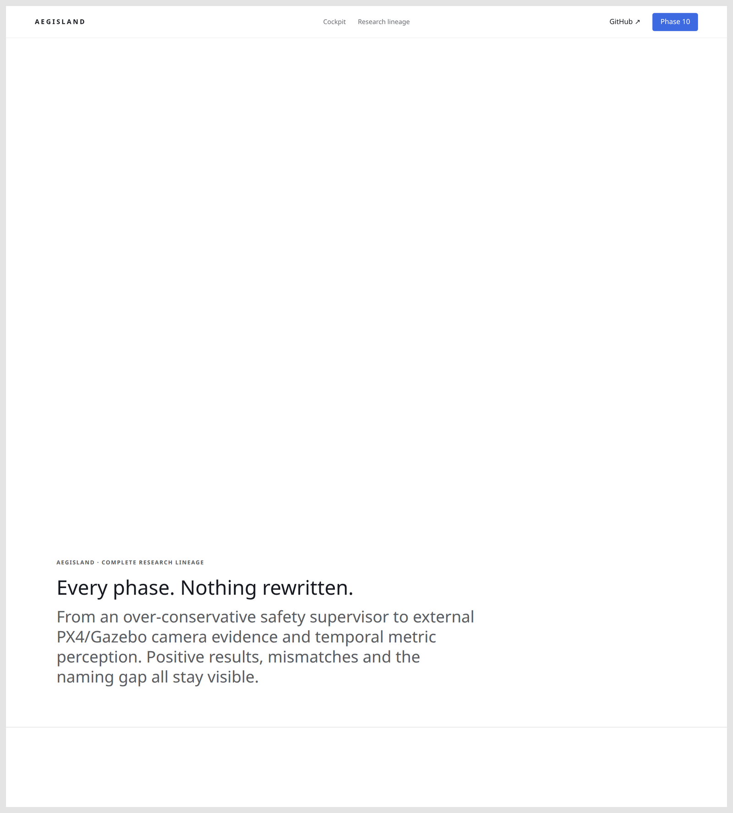
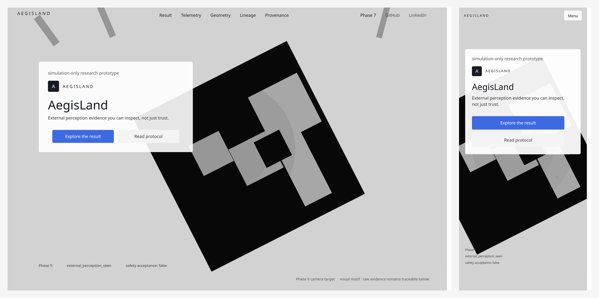
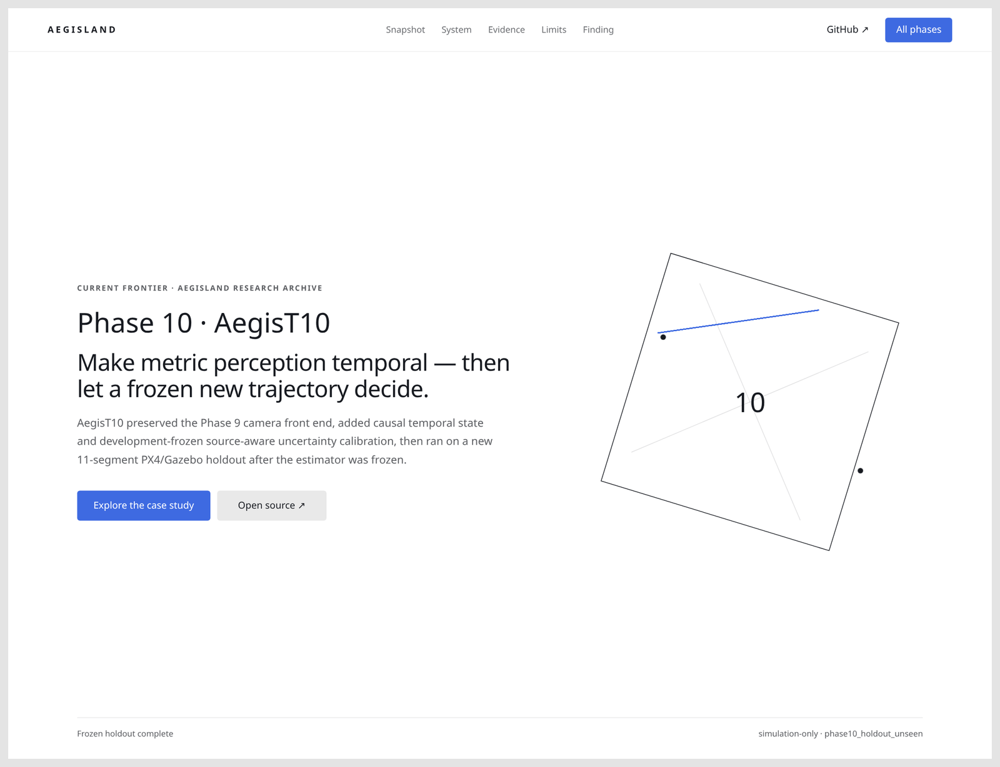
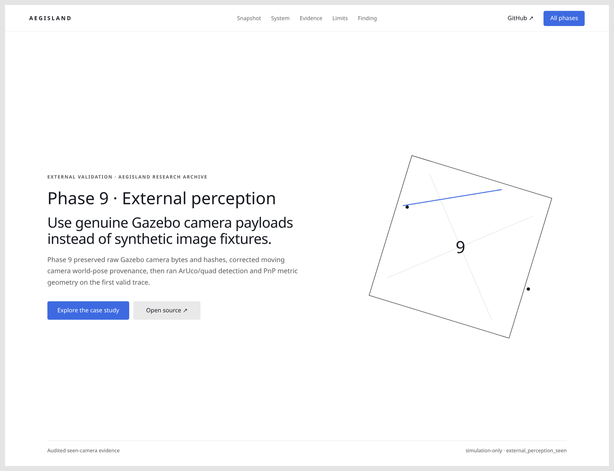
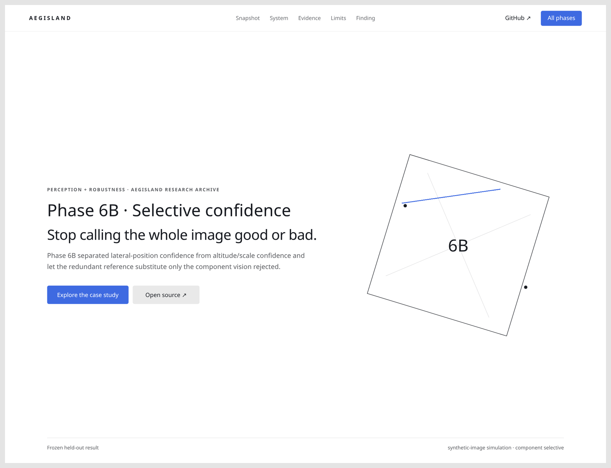
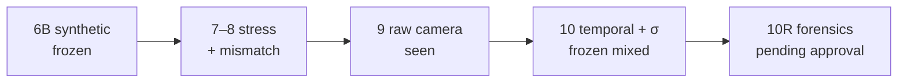

<div align="center">

# AegisLand

**External perception evidence you can inspect — not just trust.**

[](https://github.com/suhaslord/uav-safety-research/actions/workflows/ci.yml)


Simulation research on perception overconfidence, calibrated abstention, redundant estimation, and what those claims mean after PX4/Gazebo camera evidence.

<br/>

[](https://aegisland-research-cockpit.vercel.app/)

</div>

<br/>

<a href="https://aegisland-research-cockpit.vercel.app/">
  
</a>

<p align="center"><sub>Live cockpit · Phase 9/10 evidence path · <code>safety_acceptance = false</code></sub></p>

---

## The product is the archive

AegisLand is not a “landing demo.” It is a **phase-by-phase research archive** with frozen results, mismatches, and negative findings kept visible.

<a href="https://aegisland-research-cockpit.vercel.app/phases/">
  
</a>

<p align="center"><sub>Every phase. Nothing rewritten.</sub></p>

<p align="center">
  
</p>

<p align="center"><sub>Desktop cockpit + mobile archive shell</sub></p>

---

## Current frontier — Phase 10 / 10R

<a href="https://aegisland-research-cockpit.vercel.app/phases/phase10/">
  
</a>

**Research question**

> If visual perception is internally consistent but systematically wrong, can independent evidence expose the error without making landing unusably conservative?

### Frozen mixed result

AegisT10 **did not beat** Phase 9 point estimates on the holdout — because every usable observation was already clean ArUco geometry at centimeter scale. Uncertainty honesty improved sharply on the same rows.


| | Phase 9 | AegisT10 |
|---|---:|---:|
| Lateral MAE | 2.77 cm | 2.77 cm |
| Altitude MAE | 1.57 cm | 1.57 cm |
| Median \|residual\| / σ (lateral) | 13.17 | **0.65** |
| Median \|residual\| / σ (altitude) | 5.11 | **0.52** |
| 2σ coverage | — | **93% / 100%** |

Holdout: 65 raw frames · 20 truth-visible · 15 observations · **15 ArUco / 0 quad-fallback** · 5 misses · 0 false positives.

Phase 10R P0 starts with **read-only forensics** and a preregistration draft. No tuning from the five miss frames until approval.

[Phase 10 result](docs/phase10_frozen_holdout_result.md) · [10R preregistration](docs/phase10r_preregistration.md) · [Forensics](docs/phase10r_holdout_forensics.md)

---

## Case studies in the archive

<table>
  <tr>
    <td width="50%">
      <a href="https://aegisland-research-cockpit.vercel.app/phases/phase9/">
        
      </a>
      <p align="center"><b>Phase 9</b><br/><sub>Raw Gazebo camera · detection vs metric geometry</sub></p>
    </td>
    <td width="50%">
      <a href="https://aegisland-research-cockpit.vercel.app/phases/phase6b/">
        
      </a>
      <p align="center"><b>Phase 6B</b><br/><sub>Stop calling the whole image good or bad</sub></p>
    </td>
  </tr>
</table>


<p align="center">
  
  
</p>

---

## Evidence ladder

| Layer | Status | What it supports |
|---|---|---|
| Phase 6B synthetic landing | **frozen held-out** | selective confidence on the defined benchmark |
| Phase 7 stress factorial | **audited / seen** | where redundancy assumptions break |
| Phase 8 PX4/Gazebo traces | **external seen** | surrogate resemblance = `diagnostic_mismatch` |
| Phase 9 Gazebo camera | **external perception seen** | strong detection ≠ trustworthy metric geometry |
| Phase 10 temporal + σ | **frozen holdout** | uncertainty improved; point-error gate failed |
| Phase 10R P0 | **forensics only** | miss decomposition + preregistration draft |
| Physical aircraft | **not tested** | no claim |



**Nothing in this repository is a physical-flight safety acceptance.**

---

## Quickstart

```bash
git clone https://github.com/suhaslord/uav-safety-research.git
cd uav-safety-research
git checkout phase10r1-p0-forensics-infrastructure
python -m venv .venv && source .venv/bin/activate
pip install -e ".[dev]"
pytest
python scripts/serve_dashboard.py   # http://127.0.0.1:8765
```

Or open the hosted archive: **[aegisland-research-cockpit.vercel.app](https://aegisland-research-cockpit.vercel.app/)**

Regenerate README screenshots after UI changes:

```bash
python3 scripts/serve_dashboard.py &
node scripts/capture_readme_shots.mjs
```

---

## Limitations

- Simulation only — no hardware-camera or physical-flight validation
- Phase 10 holdout is small (**20** truth-visible / **15** paired observations)
- That holdout is now **seen** for Phase 10R
- Phase 8 is a short external trace with a genuine `diagnostic_mismatch`
- Passing CI ≠ UAV safety acceptance

---

## Safety

**AegisLand is not validated flight-control software.** Educational / simulation-only. Do not use it to operate a physical aircraft.

---

<div align="center">

**Suhas Beemineni** · River Islands High School

Aerospace · autonomous systems · AI reliability · reproducible research

</div>
