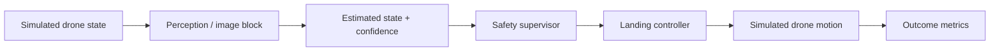
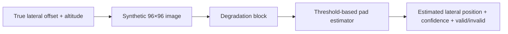

# AegisLand — UAV Safety Research

AegisLand is a **simulation-only research project about autonomous UAV landing under unreliable perception**.

> **Core question:** When a landing system's perception becomes degraded, stale, or confidently wrong, can the system recognize that before it trusts a bad estimate too much?

**Live research cockpit:** https://aegisland-research-cockpit.vercel.app/


---

## Plain-English explanation

A drone has to look at the area below it and decide where it is safe to land. In the real world, the camera image can become worse because of blur, darkness, noise, obstruction, camera motion, or other sensor problems.

AegisLand creates controlled versions of those problems in simulation and asks what happens to the landing system after the image/perception becomes worse. It also studies whether confidence and independent safety checks can tell the system when it should **continue, hold, or abort** instead of trusting a bad estimate.

A simple way to explain the current project is:

> **I test how reliable an autonomous landing system is when its camera view gets worse. I take normal images, simulate problems like blur, darkness, or noise, and check whether the system can still tell which areas are safe to land on. Then I compare the results to see whether a change actually helps the system make a better decision, not just make the image look better.**

The goal is **not** to claim a real aircraft is safe. The goal is to understand the system clearly, one block at a time, and build a research record that shows what works, what fails, and what still needs stronger evidence.

---

## Research guidance this repository now follows

The current development standard is based on the research feedback from the September 2026 review meeting.

The most important instruction was to understand the project at **both the block level and the system level**:

> “understanding each of these things, in depth, block level, and the system level, how each of them interact, what the input is, what the output is, and properly document it.”

That means every important component should answer:

1. **What is the input?**
2. **What does the block do at a high level?**
3. **What is the output?**
4. **Which block uses that output next?**
5. **What assumptions does it make?**
6. **How can it fail or become misleading?**
7. **Where is the implementation?**
8. **What reliable resource should be used to understand it more deeply?**

The second standard is the **non-technical explanation test**:

> “if someone doesn't know any of this image processing or vision, if they ask you what is your project, you should be able to explain it to them in simple terms.”

If a component cannot be explained simply without hiding behind words like “algorithm,” “AI,” or “computer vision,” then it is not documented well enough yet.

The current priority is therefore **understanding + documentation + experimental organization**, not adding unnecessary mathematical complexity. A deeper physical model of one degradation, a learned detector, or a formal paper-style project can come later after the existing pipeline is understood clearly.

---

## What distribution shift means here

A system may look reliable when it is designed and tested on clean images, but a real camera can operate under conditions that look different from the development data.

Examples include:

- blur or camera shake;
- low light;
- noise;
- partial obstruction or occlusion;
- dirt, smudges, or scratches on a lens;
- stale frames or delayed perception;
- combinations of several degradations.

This difference between the conditions the system was designed around and the conditions it later sees is the main **distribution-shift** idea behind the image/perception work.

For now, these are treated as controlled experimental **blocks**. The project does not need a full optical or physical derivation of every degradation before it can ask how those blocks affect the rest of the system.

---

## Project structure

The repository is organized like a simple research report:

**problem → data → method → experiment → result → limitation → next step**

For deeper explanations:

- **[Project Understanding Guide](docs/project_understanding_guide.md)** — the project in plain language and at implementation level.
- **[Block-Level Reference Map](docs/block_reference_map.md)** — inputs, outputs, handoffs, assumptions, code pointers, evidence, and learning references.
- **[Methodology](docs/methodology.md)** — experiment structure and evidence discipline.
- **[Reproducibility](docs/reproducibility.md)** — how frozen evaluations are kept separate from later development.

---

## 1. Problem

The immediate question is not simply **“Can I make a blurry image look clearer?”**

It is:

> **How does degraded perception change a landing system's estimate and decision, and can the system know when that estimate should not be trusted?**

This distinction matters because an image that looks better to a person does **not automatically** make the downstream landing estimate better.

The entire pipeline has to be evaluated, not just the visual appearance of the image.

---

## 2. System at a glance



### Pixel-based perception path



### Input → block → output contracts

| Block | Input | What it does | Output | Next handoff |
|---|---|---|---|---|
| Drone simulation | position, altitude, velocity | updates simulated vehicle motion | next simulated state | renderer/perception |
| Synthetic image renderer | lateral offset, altitude, condition, severity | creates a grayscale landing-pad frame | 96×96 image | degradation block |
| Degradation block | clean synthetic image | applies a controlled stress condition | degraded image | estimator |
| Pad estimator | grayscale image | thresholds bright pixels and estimates horizontal pad position | lateral estimate + confidence + valid/invalid | supervisor/controller |
| Abstract perception | true state + stress profile | adds controlled noise, bias, dropout/staleness and imperfect confidence | perceived state + confidence | supervisor |
| Safety supervisor | estimate + confidence + risk signals | decides whether to proceed, hold, or abort | safety decision | controller |
| Controller | perceived state + safety decision | produces simulated landing motion | commanded motion | simulation |
| Metrics | completed episode | measures safety, error, success, aborts and other outcomes | experiment results | analysis/reporting |

The handoff matters as much as each individual block:

```text
truth state
  → camera/perception observation
  → controlled degradation
  → estimate + confidence + validity
  → supervisor decision
  → controller command
  → next simulated state
  → saved metrics
```

A block's documented output should be the next block's documented input. No result should depend on an unexplained hidden signal.

---

## 3. What the project actually looks like

These are committed project visuals, not missing external links.

### Research cockpit


### Perception / robustness view


### External-perception view


### Later metric / validation view


### Desktop + mobile presentation


---

## 4. Data / image benchmark

The first pixel benchmark does **not** use a real external camera dataset.

It generates controlled **96×96 grayscale synthetic landing-pad images** from randomized lateral offsets and altitudes.

Phase 5 used:

- **5 conditions:** clean, blur, low light, occlusion, mixed;
- **300 images per condition**;
- **1,500 images total**.

This is a synthetic benchmark, not a real-camera validation.

### Important clarification about “blur”

There are two different uses of degradation names in the repository:

1. In `src/uav_safety/perception.py`, labels such as `blur`, `low_light`, `occlusion`, and `mixed` are **abstract stress profiles** that change noise, bias, dropout/staleness, and confidence.
2. In `src/uav_safety/image_perception.py`, pixel-level `blur` is implemented as repeated **3×3 box-blur passes**.

Neither should be described as a calibrated physical model of drone vibration, defocus, water on a lens, or a specific camera failure.

A more physical study of one mechanism can be a future project after the current system is understood clearly.

---

## 5. Current image-estimation baseline

The current pixel front end is intentionally simple. It is **not a neural network** and it does **not use OpenCV**.

`ThresholdPadEstimator` works by:

1. measuring image statistics such as median, standard deviation, and the 90th percentile;
2. creating a threshold;
3. selecting pixels above that threshold;
4. computing a brightness-weighted horizontal centroid;
5. converting the centroid to an estimated lateral offset;
6. producing a simple confidence score based on contrast and supporting pixels.

The benchmark mainly uses:

- **NumPy** for numerical/image operations;
- **pandas** for experiment tables;
- **Matplotlib** for plots.

At the current stage, the goal is to be able to run these tools, understand what each block receives and returns, and explain why each experiment is being done. Deeper detector mathematics can come later.

---

## 6. First pixel-benchmark results

Phase 5 reported:

| Condition | Valid estimates | Mean absolute lateral error | 95th-percentile error | Mean confidence |
|---|---:|---:|---:|---:|
| Clean | 100% | 0.017 m | 0.031 m | 0.833 |
| Blur | 100% | 0.016 m | 0.030 m | 0.783 |
| Low light | 100% | 0.074 m | 0.255 m | 0.636 |
| Occlusion | 100% | 0.082 m | 0.194 m | 0.818 |
| Mixed | 100% | **0.344 m** | **1.002 m** | 0.518 |

The key observation is **not** that every degradation destroys the estimator.

In this synthetic setup, simple blur barely changed the lateral-estimation error. The clearest failure appeared under **mixed degradation**: the error increased substantially while the estimator still marked **100% of the images as valid**.

That leads to the more useful system question:

> **Can the system recognize when its own perception estimate is unreliable?**

### Result visual


A broader lesson from the image/perception work is that **visual image quality and task performance are not the same thing**. A preprocessing or restoration method should be judged by what happens to the downstream estimate/decision, not only by whether the picture looks nicer.

---

## 7. Two different meanings of “baseline”

### Image-estimation baseline

`ThresholdPadEstimator` is the simple rule-based baseline for the synthetic image benchmark.

### Landing-system baseline

In the landing/control experiments, the **baseline architecture** attempts the landing without the safety supervisor. Supervised architectures add confidence/risk logic that can intervene.

Every result should state which baseline it is comparing.

---

## 8. What should be understood before adding complexity

Before adding a new major phase, learned detector, or deeper mathematical model, each current block should be understandable without opening the code.

For every block, be able to say:

- what problem it solves;
- what goes in;
- what happens inside at a high level;
- what comes out;
- what uses that output next;
- what could make it misleading;
- whether it is synthetic, simulated, or based on external evidence;
- which result tests it;
- what source you would study to understand it more deeply.

Documentation should be written **while building**, not only after everything works.

---

## 9. Current research-development focus

The immediate focus is:

- [x] explain the project in plain English;
- [x] document the high-level pipeline;
- [x] identify the input and output of each main block;
- [x] document how the blocks interact;
- [x] document what the degradation labels actually mean;
- [x] document the exact current image estimator;
- [x] state what dataset/frames are actually being used;
- [x] put the main early image results in one place;
- [x] include real committed project visuals in the README;
- [x] organize the README as problem → data → method → experiment → result → limitation → next step;
- [x] add reliable learning references for the current blocks;
- [x] separate future deep research/paper ideas from current requirements;
- [ ] keep improving the documentation until every block can be explained without looking at the code;
- [ ] practice the non-technical explanation from memory;
- [ ] later, after the system-level understanding is strong, identify one narrow result worth turning into a deeper project.

The goal right now is **not to force a paper**. It is to build the understanding needed so that a future paper-style question is real rather than artificial.

---

## 10. 60-second explanation

> AegisLand is a simulation project about safer autonomous drone landing. A landing system has to estimate where the drone is and which areas are safe, but those estimates can become unreliable when visual information gets degraded, delayed, or obstructed. I simulate those problems and measure how the estimate and landing decision change. I also compare normal behavior with safety logic that looks at confidence and other evidence before deciding whether to continue, hold, or abort. One important lesson is that an image can look better to a person without actually improving the downstream landing estimate, so the whole pipeline has to be evaluated instead of just the picture.

---

## 11. Current frozen scientific record

The scientific lineage is frozen through **Phase 22: Frozen Additive Context Transfer**.

Phase 22 asked:

> **Can a simple additive model predict a fresh 32-cell context surface without refitting?**

| Final Phase 22 check | Result |
|---|---:|
| RMSE-surface cellwise R² | **0.8319** |
| MAE-surface cellwise R² | **0.7744** |
| Stable-sign accuracy on eligible cells | **100%** |
| Locked gates | **10 / 10 PASS** |

Frozen identities:

- scientific head: `668d065714dde279857bc0e196f0ef7cc5e182ed`
- Phase 22 result SHA-256: `0ddc968b8bd48c2de6d904194b417854913389a8927cff0b15b96c6501f8294c`
- Phase 22 candidate SHA-256: `62e75d7b39088c2e66f1cc6be4d180501b79632f2f6847af1fbe0bd96be17551`

This does **not** mean every phase passed. Negative results remain part of the record instead of being rewritten after the outcome is known.


### Research map

| Area | Phases | Main question |
|---|---|---|
| Safety architecture | 1–4 | Can confidence, temporal logic, and independent evidence prevent unsafe actions? |
| Perception + robustness | 5–6B | Does the architecture still work when the system reasons from degraded image-derived measurements? |
| External validation | 7–10R | How much of the result depends on simulator, camera geometry, and environmental shift? |
| Reliability + calibration | 11–13C | Can availability and uncertainty remain trustworthy under protected and harder-domain evidence? |
| Latency + error dynamics | 14–19 | What does stale perception change, and which latency effects replicate? |
| Context structure + transfer | 20–22 | Which context factors attenuate performance, and can that structure predict fresh contexts without refitting? |

Browse the full archive: https://aegisland-research-cockpit.vercel.app/phases/

---

## 12. Additional result visuals


These figures belong to later experiments in the frozen record. They are shown here to make the evidence easier to navigate, not to collapse separate experiments into one result.

---

## 13. Paper-style organization now, paper later

The repository should practice scientific communication now:

**abstract/problem → evidence/data → method → experiment → metrics → results → limitations → conclusion/references**

That does **not** mean a formal paper should be written immediately.

A deeper paper-style project should come after the existing pipeline is understood well enough to identify one genuinely interesting narrow question. Possible future directions include physically characterizing one degradation, studying a specific sensor failure, or replacing the current rule-based estimator with a learned vision model.

Those ideas belong in future work, not as claims about what the present system already does.

---

# How to run AegisLand

## Requirements

- **Python 3.10+**
- **Git**
- a terminal such as PowerShell, Command Prompt, Terminal, or bash

No physical UAV is required. The core research code runs in simulation.

## Clone and install

```bash
git clone https://github.com/suhaslord/uav-safety-research.git
cd uav-safety-research
python -m venv .venv
```

### Windows PowerShell

```powershell
.\.venv\Scripts\Activate.ps1
```

### macOS / Linux

```bash
source .venv/bin/activate
```

Then:

```bash
python -m pip install --upgrade pip
pip install -e ".[dev]"
pytest -q
```

A passing software test suite does **not** prove flight safety.

## Run a small Monte Carlo experiment

```bash
python scripts/run_experiments.py --episodes 20 --seed 2026 --out results/demo
```

## Run the synthetic image benchmark

```bash
python scripts/run_image_perception_benchmark.py --samples 300 --seed 606060 --out results/image_perception
```

This generates the image-condition benchmark, summary tables, plots, and local visual examples from the actual benchmark code.

## Preview the historical dashboard

```bash
python scripts/serve_dashboard.py
```

Then open `http://127.0.0.1:8765`.

---

## Reproducing frozen results

The small commands above are useful for understanding the codebase, but they are **not substitutes for the sealed phase-specific evaluations**.

For frozen results:

1. read the phase preregistration/final report first;
2. keep development, transfer, protected, and final evidence separate;
3. do not tune after protected/final evidence is exposed;
4. do not reinterpret a failed gate as a pass;
5. preserve frozen code, seeds, hashes, and result artifacts.

Useful starting points:

- [Project Understanding Guide](docs/project_understanding_guide.md)
- [Block-Level Reference Map](docs/block_reference_map.md)
- [Methodology](docs/methodology.md)
- [Phase 5 image/perception results](docs/phase5_results.md)
- [Reproducibility protocol](docs/reproducibility.md)
- [Research cockpit](https://aegisland-research-cockpit.vercel.app/)
- [Full phase archive](https://aegisland-research-cockpit.vercel.app/phases/)

---

## What this project does **not** claim

- **Simulation only:** no physical-aircraft safety demonstration.
- **No real-camera equivalence:** synthetic/Gazebo evidence cannot automatically be generalized to real sensors.
- **No physically calibrated blur claim:** current degradation blocks are controlled experimental abstractions.
- **No certification claim:** experiment gates are not regulatory approval.
- **No production-readiness claim:** results do not establish operational reliability.
- **No spacecraft-transfer claim:** the UAV experiments do not by themselves prove applicability to spacecraft landing.
- **CI is software evidence, not safety evidence.**

---

## In one sentence

**AegisLand studies what happens when UAV landing perception becomes unreliable, how the rest of the system reacts, and whether it can recognize when that perception should not be trusted.**

> **Safety note:** AegisLand is educational, simulation-only research. It is not validated flight-control software and should not be used to operate a physical aircraft.
