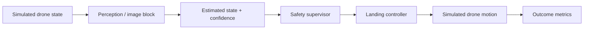
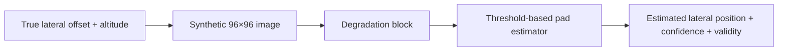

# AegisLand — UAV Safety Research

AegisLand is a **simulation-only research project about autonomous UAV landing under unreliable perception**.

> **Core question:** When a landing system's perception becomes degraded, stale, or confidently wrong, can the system recognize that before it trusts a bad estimate too much?

**Live research cockpit:** https://aegisland-research-cockpit.vercel.app/


---

## Plain-English explanation

A drone needs an estimate of where it is relative to a landing area. In the real world, that estimate can get worse because visual information becomes noisy, dim, blocked, blurred, biased, or stale.

AegisLand creates controlled versions of those problems in simulation. It then compares a normal landing path with safety-supervised approaches that can **proceed, hold, or abort** when the estimate appears unreliable.

The goal is **not** to claim a real aircraft is safe. The goal is to understand:

- what goes into each part of the system;
- what comes out of it;
- how different degradation blocks affect the result;
- when confidence is useful or misleading;
- which conclusions survive harder and previously unseen evidence.

If this explanation cannot be given clearly to a non-technical person, the project is not yet documented clearly enough.

---

## Research structure

This README is intentionally organized like a simple research report:

**problem → data → method → experiment → result → limitation → next step**

The deeper phase-by-phase scientific record is still preserved separately. For a block-level explanation of the implementation, see **[Project Understanding Guide](docs/project_understanding_guide.md)**.

---

## 1. Problem

The immediate research problem is not simply “make a blurry image look better.” It is:

> **How does degraded perception change a landing system's estimate and decision, and can the system know when that estimate should not be trusted?**

For now, conditions such as **blur, low light, occlusion, and mixed degradation are treated as experimental blocks**. The project does not need to model the full optics or physics of every degradation before it can study how those blocks interact at the system level.

A more physically detailed study of a specific blur mechanism, sensor failure, or optical model can come later.

---

## 2. System at a glance



### Pixel-based perception path



### What each block receives and returns

| Block | Input | What it does | Output |
|---|---|---|---|
| Drone simulation | position, altitude, velocity | updates simulated vehicle motion | next simulated state |
| Abstract perception | true state + stress profile | adds controlled noise, bias, dropout/staleness and imperfect confidence | perceived state + confidence |
| Synthetic image renderer | lateral offset, altitude, condition, severity | creates a grayscale landing-pad frame and applies degradation | 96×96 image |
| Pad estimator | grayscale image | thresholds bright pixels and finds a weighted horizontal centroid | lateral estimate + confidence + valid/invalid |
| Safety supervisor | estimate + confidence + uncertainty/risk signals | decides whether to proceed, hold, or abort | safety decision |
| Controller | perceived state + safety decision | produces the simulated landing command | commanded motion |
| Metrics | completed episode | measures safety, error, success, aborts, etc. | experiment results |

The point of documenting the project this way is to make every component explainable without hiding behind “the algorithm.”

---

## 3. Data / image benchmark

The first pixel benchmark does **not** use a real external camera dataset.

It generates controlled **96×96 grayscale synthetic landing-pad images** from randomized lateral offsets and altitudes.

Phase 5 used:

- **5 conditions:** clean, blur, low light, occlusion, mixed;
- **300 images per condition**;
- **1,500 images total**.

This is a synthetic benchmark, not a real-camera validation.

### Important clarification about “blur”

There are two different uses of degradation names in the repository:

1. In `src/uav_safety/perception.py`, `blur`, `low_light`, `occlusion`, and `mixed` are **abstract stress profiles** that change noise, bias, dropout/staleness, and confidence.
2. In `src/uav_safety/image_perception.py`, pixel-level `blur` is implemented as repeated **3×3 box-blur passes**.

Neither should be described as a calibrated physical model of drone vibration, defocus, water on a lens, or a specific camera failure.

---

## 4. Current image-estimation baseline

The current pixel front end is intentionally simple. It is **not a neural network** and it does **not use OpenCV**.

`ThresholdPadEstimator` works by:

1. measuring image statistics such as median, standard deviation, and the 90th percentile;
2. creating a threshold;
3. selecting pixels above that threshold;
4. computing a brightness-weighted horizontal centroid;
5. converting the centroid to an estimated lateral offset;
6. producing a simple confidence score based on contrast and supporting pixels.

The benchmark mainly uses:

- **NumPy** for numerical/image operations;
- **pandas** for experiment tables;
- **Matplotlib** for plots.

This is the right level of baseline for the current goal: understand the input, output, and system behavior first; deeper algorithmic and mathematical analysis can come later.

---

## 5. First pixel-benchmark results

Phase 5 reported:

| Condition | Valid estimates | Mean absolute lateral error | 95th-percentile error | Mean confidence |
|---|---:|---:|---:|---:|
| Clean | 100% | 0.017 m | 0.031 m | 0.833 |
| Blur | 100% | 0.016 m | 0.030 m | 0.783 |
| Low light | 100% | 0.074 m | 0.255 m | 0.636 |
| Occlusion | 100% | 0.082 m | 0.194 m | 0.818 |
| Mixed | 100% | **0.344 m** | **1.002 m** | 0.518 |

The most important observation is **not** that simple blur caused the estimator to fail. In this synthetic setup, blur barely changed the lateral-estimation error.

The clearest failure appeared under **mixed degradation**: the error increased substantially, but the estimator still marked **100% of images as valid**.

That leads to a more useful question:

> **Can the system recognize when its own perception estimate is unreliable?**

### Later image/perception work


The repository later expanded the perception work beyond the first standalone image benchmark. These later phases should be read as separate experiments with their own frozen methods and evidence rules, not as retroactive changes to the Phase 5 result.

---

## 6. Baselines: two different meanings

“Baseline” is used in two places, so the README now separates them explicitly.

### Image-estimation baseline

`ThresholdPadEstimator` is the simple rule-based baseline for the synthetic image benchmark.

### Landing-system baseline

In the landing/control experiments, the **baseline architecture** attempts the landing without the safety supervisor. Supervised architectures add confidence/risk logic that can intervene.

Any result should state which baseline it is comparing.

---

## 7. Current research-development focus

Before making the project deeper or adding another large phase, the current focus is **understanding and organization**.

The immediate checklist is:

- [x] explain the project in plain English;
- [x] document the high-level pipeline;
- [x] identify the input and output of each main block;
- [x] document what the degradation labels actually mean;
- [x] document the exact current image estimator;
- [x] state what dataset/frames are actually being used;
- [x] put the main early image results in one place;
- [x] add useful visual examples/results to the README;
- [x] organize the README as problem → data → method → experiment → result → limitation;
- [ ] keep improving the documentation until each block can be explained without looking at the code;
- [ ] use papers and technical documentation as references whenever going deeper into one component;
- [ ] later, after the system-level understanding is strong, decide whether one narrow question is worth turning into a formal paper-style project.

The goal right now is **not to force a paper**. It is to build enough understanding that a future research question would have a clear foundation.

---

## 8. 60-second explanation

> AegisLand is a simulation project about safer autonomous drone landing. A landing system has to estimate where the drone is, but those estimates can become unreliable when visual information gets degraded or stale. I simulate those problems and compare a normal landing system with a supervised system that looks at confidence and independent evidence before deciding whether to continue, hold, or abort. I also built a small synthetic image benchmark with conditions like blur, low light, and occlusion. The image estimator is intentionally simple and rule-based. One important result is that under harder mixed degradation it can still return a valid answer even when its error becomes much larger, which shows why knowing when not to trust perception is an important part of the problem.

---

## 9. Current frozen scientific record

The current scientific lineage is frozen through **Phase 22: Frozen Additive Context Transfer**.

Phase 22 asked:

> **Can a simple additive model predict a fresh 32-cell context surface without refitting?**

| Final Phase 22 check | Result |
|---|---:|
| RMSE-surface cellwise R² | **0.8319** |
| MAE-surface cellwise R² | **0.7744** |
| Stable-sign accuracy on eligible cells | **100%** |
| Locked gates | **10 / 10 PASS** |

Frozen identities:

- scientific head: `668d065714dde279857bc0e196f0ef7cc5e182ed`
- Phase 22 result SHA-256: `0ddc968b8bd48c2de6d904194b417854913389a8927cff0b15b96c6501f8294c`
- Phase 22 candidate SHA-256: `62e75d7b39088c2e66f1cc6be4d180501b79632f2f6847af1fbe0bd96be17551`

This does **not** mean every phase passed. Negative results remain part of the record instead of being rewritten after the outcome is known.


### Research map

| Area | Phases | Main question |
|---|---|---|
| Safety architecture | 1–4 | Can confidence, temporal logic, and independent evidence prevent unsafe actions? |
| Perception + robustness | 5–6B | Does the architecture still work when the system reasons from degraded image-derived measurements? |
| External validation | 7–10R | How much of the result depends on simulator, camera geometry, and environmental shift? |
| Reliability + calibration | 11–13C | Can availability and uncertainty remain trustworthy under protected and harder-domain evidence? |
| Latency + error dynamics | 14–19 | What does stale perception change, and which latency effects replicate? |
| Context structure + transfer | 20–22 | Which context factors attenuate performance, and can that structure predict fresh contexts without refitting? |

Browse the full archive: https://aegisland-research-cockpit.vercel.app/phases/

---

## 10. Additional result visuals


These figures belong to later phases of the frozen research record. They are included here to make the evidence easier to navigate, not to collapse different experiments into one result.

---

# How to run AegisLand

## 1. Requirements

- **Python 3.10+**
- **Git**
- a terminal such as PowerShell, Command Prompt, Terminal, or bash

No physical UAV is required. The core research code runs in simulation.

## 2. Clone and install

```bash
git clone https://github.com/suhaslord/uav-safety-research.git
cd uav-safety-research
python -m venv .venv
```

Activate the environment.

### Windows PowerShell

```powershell
.\.venv\Scripts\Activate.ps1
```

### macOS / Linux

```bash
source .venv/bin/activate
```

Then install and test:

```bash
python -m pip install --upgrade pip
pip install -e ".[dev]"
pytest -q
```

A passing software test suite does **not** prove flight safety.

## 3. Run a small Monte Carlo experiment

```bash
python scripts/run_experiments.py --episodes 20 --seed 2026 --out results/demo
```

Typical outputs include:

- `episodes.csv`
- `summary.csv`
- `summary.md`
- `unsafe_touchdown_rate.png`
- `success_rate.png`
- `run_metadata.json`

## 4. Run the synthetic image benchmark

```bash
python scripts/run_image_perception_benchmark.py --samples 300 --seed 606060 --out results/image_perception
```

This produces the image-condition benchmark, summary tables, plots, and generated visual examples locally.

## 5. Preview the historical dashboard

```bash
python scripts/serve_dashboard.py
```

Then open `http://127.0.0.1:8765`.

The current published cockpit is at:
https://aegisland-research-cockpit.vercel.app/

---

## Reproducing the frozen scientific record

The small commands above are useful for understanding the codebase, but they are **not substitutes for the sealed phase-specific evaluations**.

For frozen results:

1. read the phase preregistration/final report first;
2. keep development, transfer, protected, and final evidence separate;
3. do not tune after protected/final evidence is exposed;
4. do not reinterpret a failed gate as a pass;
5. preserve frozen code, seeds, hashes, and result artifacts.

Useful starting points:

- [Project Understanding Guide](docs/project_understanding_guide.md)
- [Methodology](docs/methodology.md)
- [Phase 5 image/perception results](docs/phase5_results.md)
- [Reproducibility protocol](docs/reproducibility.md)
- [Research cockpit](https://aegisland-research-cockpit.vercel.app/)
- [Full phase archive](https://aegisland-research-cockpit.vercel.app/phases/)

---

## What this project does **not** claim

- **Simulation only:** no physical-aircraft safety demonstration.
- **No real-camera equivalence:** synthetic/Gazebo evidence cannot automatically be generalized to real sensors.
- **No physically calibrated blur claim:** current degradation blocks are controlled experimental abstractions.
- **No certification claim:** experiment gates are not regulatory approval.
- **No production-readiness claim:** results do not establish operational reliability.
- **No spacecraft-transfer claim:** the UAV experiments do not by themselves prove applicability to spacecraft landing.
- **CI is software evidence, not safety evidence.**

---

## In one sentence

**AegisLand studies what happens when UAV landing perception becomes unreliable, how the rest of the system reacts, and whether it can recognize when that perception should not be trusted.**

> **Safety note:** AegisLand is educational, simulation-only research. It is not validated flight-control software and should not be used to operate a physical aircraft.
