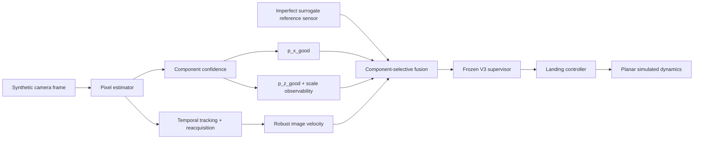

<div align="center">

# AegisLand

### Confidence-Aware Redundant Perception for Simulated Autonomous UAV Landing

> **When vision is internally consistent but wrong, can independent evidence reveal the error without making the system unusably conservative?**

[](https://github.com/suhaslord/uav-safety-research/actions/workflows/ci.yml)


**A reproducible simulation study of persistent perception bias, temporal image perception, calibrated abstention, redundant estimation, and safety–availability tradeoffs.**

</div>

---

## Latest result: Phase 6B

AegisLand now runs an end-to-end synthetic image path:



The key Phase 6B change is **component-wise abstention**. A frame is not forced into one global `good/bad` label. The system may keep a trustworthy lateral image estimate while rejecting an unreliable altitude estimate and temporarily using the independent reference for altitude only.

### Frozen held-out landing study

Phase 6B was frozen before evaluation at executable commit:

`b4e9838555e935a5ec42690495315473629b58f6`

The preflight suite passed **53 tests**. The held-out landing seed `868686` was then run once with 100 paired episodes for each of five image conditions and three architectures: **1,500 simulated landing episodes total**.

| Condition | Image-only success / unsafe | Original Phase 6 Aegis | **Phase 6B success / unsafe** | Phase 6B timeout |
|---|---:|---:|---:|---:|
| clean | 100% / 0% | 100% / 0% | **100% / 0%** | 0% |
| blur | 100% / 0% | 100% / 0% | **100% / 0%** | 0% |
| low light | 100% / 0% | 100% / 0% | **97% / 0%** | **3%** |
| occlusion | 86% / 14% | 93% / 7% | **96% / 4%** | 0% |
| **mixed** | **57% / 43%** | **94% / 6%** | **99% / 1%** | 0% |

All Phase 6B abort rates were 0% in this held-out run.

For `mixed` degradation, Phase 6B improved success by **42 percentage points** and reduced unsafe touchdowns by **42 points** relative to image-only temporal perception. Relative to the established Phase 6 Aegis path on the same paired held-out episodes, Phase 6B improved success by **5 points** and reduced unsafe touchdowns by **5 points**.

Paired mixed episodes showed:

- **43** image-only unsafe touchdowns became Phase 6B successes;
- **1** image-only success became a Phase 6B unsafe touchdown;
- **6** original Phase 6 unsafe touchdowns became Phase 6B successes;
- **1** original Phase 6 success became a Phase 6B unsafe touchdown.

For Phase 6B mixed degradation, the 95% Wilson interval was **94.55%–99.82%** for success and **0.18%–5.45%** for unsafe touchdown.

The low-light `97% success / 3% timeout` result is intentionally retained. Phase 6B is not presented as uniformly better: stronger selective substitution improved the hardest mixed/occlusion conditions while creating a measurable completion cost under low light.

Full result: [`docs/phase6b_results.md`](docs/phase6b_results.md)

---

## Held-out selective-perception audit

A separate frozen seed, `878787`, evaluated **10,000 synthetic frames** without changing the `0.80 / 0.80` component gates.

At the fixed altitude-confidence gate:

| Condition | Altitude coverage | Selected bad-altitude rate | Bad-altitude rejection |
|---|---:|---:|---:|
| clean | 100% | 0% | n/a — no bad altitude cases |
| blur | 20.95% | 0% | **100%** |
| low light | 30.55% | **0.16%** | **99.35%** |
| mixed | 0.85% | 0% | **100%** |
| occlusion | 100% | 0% | n/a — no bad altitude cases |

This is a major improvement over the original Phase 6 scalar abstention behavior, but it also exposes a remaining limitation: under mixed degradation, lateral coverage was **96.6%** with a **3.99% selected bad-lateral rate**, and the gate rejected only about **10.5%** of bad lateral estimates.

So the claim is deliberately narrow: **Phase 6B makes altitude/scale confidence strongly selective in this synthetic benchmark; lateral selective confidence remains imperfect.**

---

## Why the observability cap exists

The synthetic renderer represents apparent landing-marker size with integer pixels. At high altitude, one pixel of apparent-size change can correspond to a large change in inferred altitude. A frame can therefore be sharp and well detected while still lacking enough scale resolution for a precise altitude estimate.

Phase 6B computes the adjacent scale-bin altitude width and caps `p_z_good` so the confidence model cannot claim more altitude precision than the rendered pixel geometry supports.

This cap is **specific to the synthetic renderer**. It is an experimental observability check, not a real-camera uncertainty formula.

---

## Research progression

AegisLand was developed through measured failures rather than deleting old results when they looked bad.

| Stage | Main idea | What it taught us |
|---|---|---|
| **Baseline** | trust the primary estimate | easy cases are fine; severe bias can cause unsafe touchdowns |
| **V1** | static confidence/risk thresholds | safety can improve by becoming unusably conservative |
| **V2** | temporal smoothing + persistence | availability returns, but persistent bias remains hard to detect from one stream |
| **V3** | independent redundant estimate + bias-aware fusion | independent error structure exposes persistent visual bias in abstract-perception simulation |
| **Phase 5** | robustness sweeps | V3 generalizes across multiple stress axes, but reference quality matters |
| **Phase 6** | actual synthetic pixel sequences | pixel perception introduces tracking, velocity, calibration, and observability failures |
| **Phase 6B** | component confidence + selective fusion | unreliable altitude can be rejected without discarding still-useful lateral image information |

Future Phase 6C/6D experimental scaffolding is intentionally separated onto the `phase6-future-experiments` branch. It is **not** part of the frozen Phase 6B result.

---

## Earlier frozen V3 result

Before the image front end, V3 was evaluated with 500 paired episode seeds per profile/architecture cell for **10,000 simulated episodes**.

| Profile | Baseline unsafe | V2 unsafe | **V3 unsafe** | **V3 success** |
|---|---:|---:|---:|---:|
| clean | 0.0% | 0.0% | **0.0%** | **100.0%** |
| blur | 0.0% | 0.0% | **0.0%** | **100.0%** |
| low light | 0.0% | 0.2% | **0.0%** | **100.0%** |
| occlusion | 34.6% | 33.6% | **1.4%** | **98.6%** |
| **mixed** | **84.2%** | **84.0%** | **2.4%** | **97.6%** |

Full V3 result: [`docs/v3_results.md`](docs/v3_results.md)

---

## Reproducibility

The project now includes:

- deterministic top-level seeds;
- paired architecture comparisons;
- isolated environment/image/reference RNG streams;
- separate calibration, development, and frozen seeds;
- explicit freeze protocols before held-out evaluation;
- 95% Wilson intervals;
- paired rescue/regression counts;
- touchdown failure decomposition;
- calibration ECE and risk/coverage audits;
- high-altitude observability audits;
- automated tests and GitHub Actions;
- retained negative/intermediate results;
- permanent compressed archives of the final Phase 6B raw evidence.

Frozen Phase 6B evidence:

- [`results/phase6b_frozen_landing/`](results/phase6b_frozen_landing/)
- [`results/phase6b_frozen_selective/`](results/phase6b_frozen_selective/)

The large `episodes.csv` and `frames.csv` files are committed as `.csv.gz`; only compression was applied after the frozen Actions artifacts were downloaded.

---

## Reproduce key experiments

```bash
git clone https://github.com/suhaslord/uav-safety-research.git
cd uav-safety-research
python -m venv .venv
pip install -e ".[dev]"
pytest -q
```

### Frozen V3

```bash
python scripts/run_v3_comparison.py --episodes 500 --seed 424242 --out results/v3_frozen
python scripts/validate_v3_frozen.py --out results/v3_frozen --seed 424242 --episodes 500
```

### Frozen Phase 6B landing comparison

```bash
python scripts/run_phase6b_landing.py \
  --episodes 100 \
  --seed 868686 \
  --calibration-seed 616161 \
  --temporal-calibration-samples 180 \
  --component-calibration-samples 280 \
  --lateral-threshold 0.80 \
  --altitude-threshold 0.80 \
  --run-role frozen \
  --out results/phase6b_frozen_landing
```

### Frozen Phase 6B selective audit

```bash
python scripts/run_phase6_component_calibration.py \
  --sequences 20 \
  --frames 100 \
  --seed 878787 \
  --calibration-seed 616161 \
  --calibration-samples 280 \
  --out results/phase6b_frozen_selective
```

Do not reuse `868686` or `878787` as unseen evaluation seeds; both have now been observed.

---

## Current limitations

The strongest results are still **simulation evidence**, not real-flight validation.

Important limitations include:

- planar dynamics rather than full 6-DOF aircraft dynamics;
- synthetic imagery and synthetic degradation;
- a surrogate independent reference sensor rather than a physically modeled navigation stack;
- the surrogate sensor is generated from simulated true state plus independent noise/dropout before being consumed by Aegis;
- the altitude observability rule is renderer-specific;
- no common-mode/correlated sensor-failure benchmark yet;
- mixed lateral confidence remains weakly selective;
- low-light Phase 6B introduced a 3% timeout rate in the final held-out run;
- no hardware or physical-flight validation.

The next research step should attack those external-validity limitations rather than retune the frozen Phase 6B result.

---

## Paper workspace

- [`paper/abstract.md`](paper/abstract.md)
- [`docs/phase6b_results.md`](docs/phase6b_results.md)
- [`docs/phase6b_calibration_revision.md`](docs/phase6b_calibration_revision.md)
- [`docs/phase6b_evaluation_protocol.md`](docs/phase6b_evaluation_protocol.md)
- [`docs/phase6b_freeze_manifest.md`](docs/phase6b_freeze_manifest.md)

---

## Safety scope

**AegisLand is not flight-control software.**

It is an educational, simulation-only research project. It is not validated for physical aircraft and should not be used to operate one.

---

## Author

**Suhas Beemineni**  
River Islands High School

Interested in aerospace engineering, autonomous systems, AI reliability, computational engineering, and research.

Technical criticism, methodology review, and reproducibility feedback are welcome.
