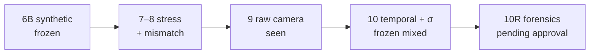

<div align="center">

# AegisLand

**External perception evidence you can inspect — not just trust.**

[](https://github.com/suhaslord/uav-safety-research/actions/workflows/ci.yml)


Simulation research on perception overconfidence, calibrated abstention, redundant estimation, and what those claims mean after PX4/Gazebo camera evidence.

<br/>

[](https://aegisland-research-cockpit.vercel.app/)

</div>

<br/>

<a href="https://aegisland-research-cockpit.vercel.app/">
  
</a>

<p align="center"><sub>Live cockpit · Phase 9/10 evidence path · <code>safety_acceptance = false</code></sub></p>

---

## The product is the archive

AegisLand is not a “landing demo.” It is a **phase-by-phase research archive** with frozen results, mismatches, and negative findings kept visible.

<a href="https://aegisland-research-cockpit.vercel.app/phases/">
  
</a>

<p align="center"><sub>Every phase. Nothing rewritten.</sub></p>

<p align="center">
  
</p>

<p align="center"><sub>Desktop cockpit + mobile archive shell</sub></p>

---

## Current frontier — Phase 10 / 10R

<a href="https://aegisland-research-cockpit.vercel.app/phases/phase10/">
  
</a>

**Research question**

> If visual perception is internally consistent but systematically wrong, can independent evidence expose the error without making landing unusably conservative?

### Frozen mixed result

AegisT10 **did not beat** Phase 9 point estimates on the holdout — because every usable observation was already clean ArUco geometry at centimeter scale. Uncertainty honesty improved sharply on the same rows.


#### Point estimates — gate failed

<table>
  <thead>
    <tr>
      <th align="left">Metric</th>
      <th align="right">Phase 9</th>
      <th align="right">AegisT10</th>
      <th align="center">Δ</th>
      <th align="left">Verdict</th>
    </tr>
  </thead>
  <tbody>
    <tr>
      <td>Lateral MAE</td>
      <td align="right"><code>2.77 cm</code></td>
      <td align="right"><code>2.77 cm</code></td>
      <td align="center">0%</td>
      <td>matched · no substantial win</td>
    </tr>
    <tr>
      <td>Altitude MAE</td>
      <td align="right"><code>1.57 cm</code></td>
      <td align="right"><code>1.57 cm</code></td>
      <td align="center">0%</td>
      <td>matched · no substantial win</td>
    </tr>
    <tr>
      <td>Lateral p95</td>
      <td align="right"><code>5.59 cm</code></td>
      <td align="right"><code>5.59 cm</code></td>
      <td align="center">0%</td>
      <td>matched · no substantial win</td>
    </tr>
    <tr>
      <td>Altitude p95</td>
      <td align="right"><code>2.93 cm</code></td>
      <td align="right"><code>2.93 cm</code></td>
      <td align="center">0%</td>
      <td>matched · no substantial win</td>
    </tr>
  </tbody>
</table>

#### Uncertainty honesty — improved

<table>
  <thead>
    <tr>
      <th align="left">Metric</th>
      <th align="right">Phase 9</th>
      <th align="right">AegisT10</th>
      <th align="left">Reading</th>
    </tr>
  </thead>
  <tbody>
    <tr>
      <td>Median |lateral residual| / σ</td>
      <td align="right"><code>13.17</code></td>
      <td align="right"><b><code>0.65</code></b></td>
      <td>overconfident → near σ-honest</td>
    </tr>
    <tr>
      <td>Median |altitude residual| / σ</td>
      <td align="right"><code>5.11</code></td>
      <td align="right"><b><code>0.52</code></b></td>
      <td>overconfident → near σ-honest</td>
    </tr>
    <tr>
      <td>2σ coverage (lat / alt)</td>
      <td align="right">—</td>
      <td align="right"><b><code>93% / 100%</code></b></td>
      <td>calibrated uncertainty held</td>
    </tr>
  </tbody>
</table>

#### Holdout composition

<table>
  <thead>
    <tr>
      <th align="center">Raw frames</th>
      <th align="center">Truth-visible</th>
      <th align="center">Observations</th>
      <th align="center">Misses</th>
      <th align="center">False positives</th>
      <th align="center">Detector mix</th>
    </tr>
  </thead>
  <tbody>
    <tr>
      <td align="center"><b>65</b></td>
      <td align="center"><b>20</b></td>
      <td align="center"><b>15</b></td>
      <td align="center"><b>5</b></td>
      <td align="center"><b>0</b></td>
      <td align="center"><b>15 ArUco · 0 fallback</b></td>
    </tr>
  </tbody>
</table>

#### Preregistered gate scorecard

<table>
  <thead>
    <tr>
      <th align="left">Gate</th>
      <th align="center">Result</th>
      <th align="left">Detail</th>
    </tr>
  </thead>
  <tbody>
    <tr>
      <td>Metric availability drop ≤ 2 pp</td>
      <td align="center">✅ pass</td>
      <td>no availability loss vs Phase 9</td>
    </tr>
    <tr>
      <td>No false-positive regression</td>
      <td align="center">✅ pass</td>
      <td>0 false positives on holdout</td>
    </tr>
    <tr>
      <td>Median norm. residual &lt; 2 (both axes)</td>
      <td align="center">✅ pass</td>
      <td>0.65 lateral · 0.52 altitude</td>
    </tr>
    <tr>
      <td>≥50% MAE reduction (lat / alt)</td>
      <td align="center">❌ fail</td>
      <td>ArUco-only holdout left no point-error to rescue</td>
    </tr>
    <tr>
      <td>≥35% p95 reduction (lat / alt)</td>
      <td align="center">❌ fail</td>
      <td>same paired centimeter geometry retained</td>
    </tr>
  </tbody>
</table>

Phase 10R P0 starts with **read-only forensics** and a preregistration draft. No tuning from miss frames `27, 35, 36, 46, 47` until approval.

<table>
  <tr>
    <td align="center"><a href="docs/phase10_frozen_holdout_result.md"><b>Phase 10 result</b></a></td>
    <td align="center"><a href="docs/phase10r_preregistration.md"><b>10R preregistration</b></a></td>
    <td align="center"><a href="docs/phase10r_holdout_forensics.md"><b>Forensics</b></a></td>
  </tr>
</table>

---

## Case studies in the archive

<table>
  <tr>
    <td width="50%" valign="top">
      <a href="https://aegisland-research-cockpit.vercel.app/phases/phase9/">
        
      </a>
      <p align="center">
        <b>Phase 9 · Raw Gazebo camera</b><br/>
        <sub>external perception seen</sub><br/>
        <sub>Strong detection can coexist with poor metric geometry.</sub>
      </p>
    </td>
    <td width="50%" valign="top">
      <a href="https://aegisland-research-cockpit.vercel.app/phases/phase6b/">
        
      </a>
      <p align="center">
        <b>Phase 6B · Selective confidence</b><br/>
        <sub>frozen held-out</sub><br/>
        <sub>Stop calling the whole image good or bad.</sub>
      </p>
    </td>
  </tr>
</table>

### Phase 6B mixed degradation (held-out landings)


<table>
  <thead>
    <tr>
      <th align="left">Architecture</th>
      <th align="right">Success</th>
      <th align="right">Unsafe</th>
      <th align="left">vs image-only</th>
    </tr>
  </thead>
  <tbody>
    <tr>
      <td>Image-only temporal</td>
      <td align="right"><code>57%</code></td>
      <td align="right"><code>43%</code></td>
      <td>—</td>
    </tr>
    <tr>
      <td>Phase 6 Aegis</td>
      <td align="right"><code>94%</code></td>
      <td align="right"><code>6%</code></td>
      <td>+37 pp success · −37 pp unsafe</td>
    </tr>
    <tr>
      <td><b>Phase 6B selective</b></td>
      <td align="right"><b><code>99%</code></b></td>
      <td align="right"><b><code>1%</code></b></td>
      <td>+42 pp success · −42 pp unsafe</td>
    </tr>
  </tbody>
</table>

<p align="center"><sub>Low-light Phase 6B retained a deliberate <b>3% timeout</b> cost — not erased after the fact.</sub></p>

### V3 abstract mixed profile (10,000 episodes)


<table>
  <thead>
    <tr>
      <th align="left">Architecture</th>
      <th align="right">Unsafe touchdown</th>
      <th align="right">Success</th>
      <th align="left">Lesson</th>
    </tr>
  </thead>
  <tbody>
    <tr>
      <td>Baseline</td>
      <td align="right"><code>84.2%</code></td>
      <td align="right"><code>15.8%</code></td>
      <td>persistent visual bias remains dangerous</td>
    </tr>
    <tr>
      <td>V2 temporal</td>
      <td align="right"><code>84.0%</code></td>
      <td align="right"><code>16.0%</code></td>
      <td>smoothing does not expose single-stream bias</td>
    </tr>
    <tr>
      <td><b>V3 redundant</b></td>
      <td align="right"><b><code>2.4%</code></b></td>
      <td align="right"><b><code>97.6%</code></b></td>
      <td>independent error structure can expose the bias</td>
    </tr>
  </tbody>
</table>

<p align="center">
  
  
</p>

---

## Evidence ladder



<table>
  <thead>
    <tr>
      <th align="center">#</th>
      <th align="left">Layer</th>
      <th align="left">Status</th>
      <th align="left">What it supports</th>
      <th align="center">Safety claim?</th>
    </tr>
  </thead>
  <tbody>
    <tr>
      <td align="center"><code>6B</code></td>
      <td>Synthetic landing + selective confidence</td>
      <td><code>frozen held-out</code></td>
      <td>Result for the defined synthetic benchmark</td>
      <td align="center">No</td>
    </tr>
    <tr>
      <td align="center"><code>7</code></td>
      <td>External-validity stress factorial</td>
      <td><code>audited / seen</code></td>
      <td>Where redundancy assumptions break</td>
      <td align="center">No</td>
    </tr>
    <tr>
      <td align="center"><code>8</code></td>
      <td>PX4/Gazebo trace comparison</td>
      <td><code>external seen</code></td>
      <td>Surrogate resemblance = <code>diagnostic_mismatch</code></td>
      <td align="center">No</td>
    </tr>
    <tr>
      <td align="center"><code>9</code></td>
      <td>Genuine Gazebo camera evidence</td>
      <td><code>external perception seen</code></td>
      <td>Detection can look strong while metric geometry fails</td>
      <td align="center">No</td>
    </tr>
    <tr>
      <td align="center"><code>10</code></td>
      <td>Temporal metric + calibrated σ</td>
      <td><code>frozen holdout</code></td>
      <td>Uncertainty improved; point-error gate failed</td>
      <td align="center">No</td>
    </tr>
    <tr>
      <td align="center"><code>10R</code></td>
      <td>Holdout forensics + preregistration</td>
      <td><code>forensics only</code></td>
      <td>Miss decomposition; approval gate before new data</td>
      <td align="center">No</td>
    </tr>
    <tr>
      <td align="center">—</td>
      <td>Physical aircraft</td>
      <td><code>not tested</code></td>
      <td>No hardware or flight validation</td>
      <td align="center"><b>No</b></td>
    </tr>
  </tbody>
</table>

**Nothing in this repository is a physical-flight safety acceptance.**  
<code>safety_acceptance = false</code> · <code>controller_tuning_allowed = false</code> · simulation only.

---

## Quickstart

```bash
git clone https://github.com/suhaslord/uav-safety-research.git
cd uav-safety-research
git checkout phase10r1-p0-forensics-infrastructure
python -m venv .venv && source .venv/bin/activate
pip install -e ".[dev]"
pytest
python scripts/serve_dashboard.py   # http://127.0.0.1:8765
```

Or open the hosted archive: **[aegisland-research-cockpit.vercel.app](https://aegisland-research-cockpit.vercel.app/)**

Regenerate README screenshots after UI changes:

```bash
python3 scripts/serve_dashboard.py &
node scripts/capture_readme_shots.mjs
```

---

## Limitations

<table>
  <thead>
    <tr>
      <th align="left">Limit</th>
      <th align="left">Why it matters</th>
    </tr>
  </thead>
  <tbody>
    <tr>
      <td>Simulation only</td>
      <td>No hardware-camera or physical-flight validation</td>
    </tr>
    <tr>
      <td>Small Phase 10 holdout</td>
      <td><b>20</b> truth-visible frames · <b>15</b> paired observations</td>
    </tr>
    <tr>
      <td>Holdout now seen</td>
      <td>Cannot be reused as a hidden Phase 10R test</td>
    </tr>
    <tr>
      <td>Short Phase 8 external trace</td>
      <td>Produced a genuine <code>diagnostic_mismatch</code>, not a pass</td>
    </tr>
    <tr>
      <td>CI green ≠ flight-safe</td>
      <td>Passing tests does not imply UAV safety acceptance</td>
    </tr>
  </tbody>
</table>

---

## Safety

**AegisLand is not validated flight-control software.** Educational / simulation-only. Do not use it to operate a physical aircraft.

---

<div align="center">

**Suhas Beemineni** · River Islands High School

Aerospace · autonomous systems · AI reliability · reproducible research

</div>
