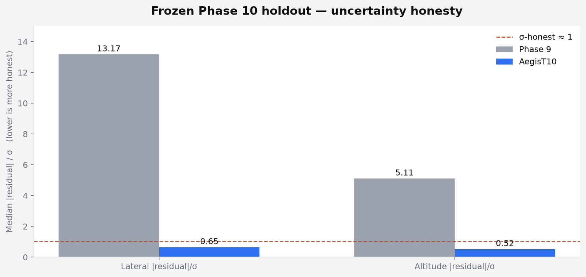
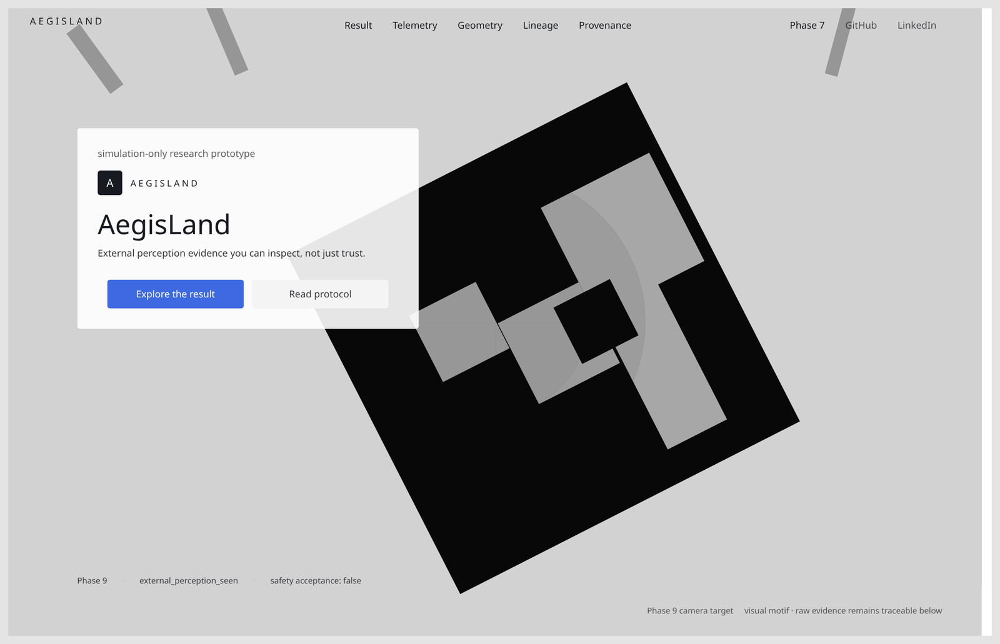
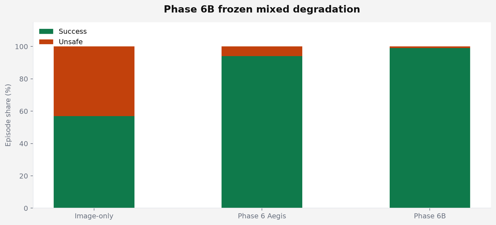
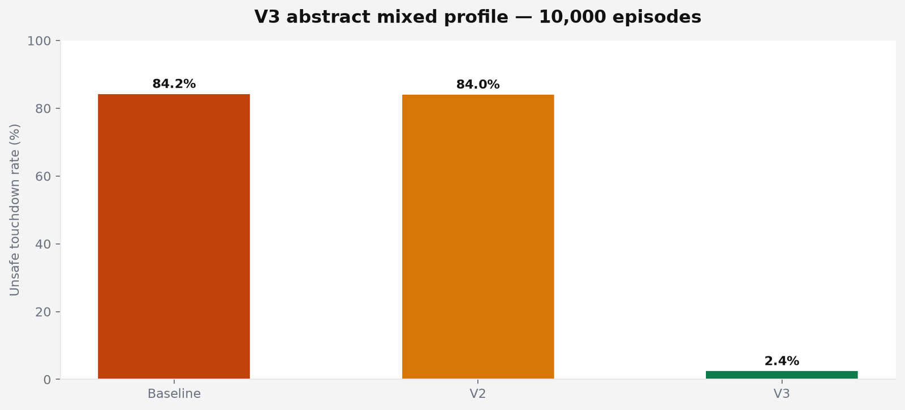
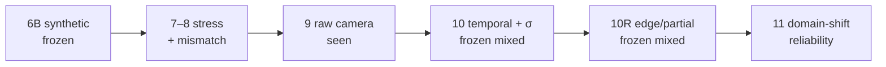

<div align="center">

# AegisLand

**External perception evidence you can inspect — not just trust.**

[](https://github.com/suhaslord/uav-safety-research/actions/workflows/ci.yml)


Simulation research on perception overconfidence, calibrated abstention, redundant estimation, and PX4/Gazebo camera evidence limits.

> If visual perception is internally consistent but systematically wrong, can independent evidence expose the error without making landing unusably conservative?

| [Live archive](https://aegisland-research-cockpit.vercel.app/) | [Phase 10R frozen result](docs/phase10r_frozen_holdout_result.md) | [Phase 10R protocol](docs/phase10r_frozen_holdout_protocol.md) | [Phase 10 result](docs/phase10_frozen_holdout_result.md) |
| :---: | :---: | :---: | :---: |

</div>

---

## Current frontier — Phase 10R frozen holdout

The Phase 10R candidate was frozen at `e1d566f8baa47bf10f9bdf39dd5988724208be80`, then evaluated **once** on a new protected holdout: 12 new geometry trajectories, three appearance conditions, 36 sequences, and **1,440 truth-visible frames**. The final result is **mixed / failed overall** under the preregistered all-gates rule and is preserved without post-holdout retuning.

| Frozen gate | Result | Reading |
|---|:---:|---|
| Clean lateral / altitude MAE ≤ 1.10× Phase 9 | **PASS** | `0.704× / 0.417×` |
| Ambiguous lateral MAE improvement ≥ 30% | **PASS** | **79.2%** |
| Ambiguous altitude MAE improvement ≥ 30% | **PASS** | **73.7%** |
| Ambiguous lateral p95 improvement ≥ 25% | **FAIL** | **−1.1%** |
| Ambiguous altitude p95 improvement ≥ 25% | **FAIL** | **7.3%** |
| Truth-visible miss rate ≤ 10% | **FAIL** | **20.0%** |
| False-positive rate ≤ 1% | **PASS** | **0.0%** |
| 95% uncertainty coverage 90–98% | **FAIL** | **84.3% lateral / 79.7% altitude** |

**The important finding:** Phase 10R dramatically reduced *average* ambiguous-view error while leaving a hard tail, a 20% availability gap, and under-covering uncertainty after appearance + geometry shift. That is direct evidence that good in-domain calibration did **not** automatically survive distribution shift.

This motivates **Phase 11: domain-shift-aware perception reliability** — focus on coverage under shift, tail failures, and principled abstention rather than retuning Phase 10R after the fact.

---

## Phase 10R development / validation checkpoint

Before the frozen holdout, the candidate showed a stronger validation profile on 1,200 truth-visible frames:

- difficult miss rate `25.70% → 8.72%` (**66.0% relative reduction**);
- lateral MAE improvement **30.1%**;
- altitude MAE / p95 improvement **53.0% / 44.9%**;
- 95% coverage **94.1% / 94.1%**.

That validation result was already mixed because lateral magnitude gates did not all pass. The harder frozen holdout then exposed the larger calibration/tail/availability problem. See [the development/validation record](docs/phase10r_development_validation_result.md).

---

## Phase 10 frozen mixed result

AegisT10 **did not beat** Phase 9 point estimates on the Gazebo-camera holdout. Every usable observation was already clean ArUco geometry at centimeter scale, so temporal filtering had nothing catastrophic to rescue. **Uncertainty honesty improved sharply** on the same paired rows. The mixed result was frozen; nothing was retuned after exposure.



| Metric | Phase 9 | AegisT10 | Reading |
|---|---:|---:|---|
| Lateral / altitude MAE | `2.77 / 1.57 cm` | `2.77 / 1.57 cm` | matched · point-error gate `FAIL` |
| Median \|residual\| / σ (lat / alt) | `13.17 / 5.11` | **`0.65 / 0.52`** | overconfident → near σ-honest |
| 2σ coverage (lat / alt) | — | **`93% / 100%`** | calibrated uncertainty held |
| Holdout | 65 raw · 20 visible · 15 obs · 5 misses · 0 FP | **15 ArUco · 0 fallback** | why the temporal win did not transfer |

Phase 10R was motivated by the five truth-visible Phase 10 misses (`27, 35, 36, 46, 47`), but those historical frames were used only for descriptive forensics — not model selection.

<a href="https://aegisland-research-cockpit.vercel.app/">
  
</a>

<p align="center"><sub>Live cockpit · <code>safety_acceptance = false</code></sub></p>

---

## Earlier frozen milestones

### Phase 6B — selective confidence



| Architecture | Success | Unsafe | vs image-only |
|---|---:|---:|---|
| Image-only temporal | `57%` | `43%` | — |
| Phase 6 Aegis | `94%` | `6%` | +37 pp success · −37 pp unsafe |
| **Phase 6B selective** | **`99%`** | **`1%`** | +42 pp success · −42 pp unsafe |

Low-light Phase 6B kept a deliberate **3% timeout** cost.

### V3 — abstract redundant perception



| Architecture | Unsafe | Success | Lesson |
|---|---:|---:|---|
| Baseline | `84.2%` | `15.8%` | persistent visual bias remains dangerous |
| V2 temporal | `84.0%` | `16.0%` | smoothing does not expose single-stream bias |
| **V3 redundant** | **`2.4%`** | **`97.6%`** | independent error structure can expose the bias |

---

## Evidence ladder



| # | Layer | Status | What it supports |
|:---:|---|---|---|
| `6B` | Synthetic landing + selective confidence | `frozen held-out` | defined synthetic benchmark result |
| `7` | External-validity stress factorial | `audited / seen` | where redundancy assumptions break |
| `8` | PX4/Gazebo trace comparison | `external seen` | resemblance = `diagnostic_mismatch` |
| `9` | Genuine Gazebo camera evidence | `external perception seen` | strong detection ≠ trustworthy metric geometry |
| `10` | Temporal metric + calibrated σ | `frozen holdout` | uncertainty improved; point-error gate failed |
| `10R` | Edge/partial-view generalization | `frozen holdout` | mean error improved; tail, availability and shift calibration gates failed |
| `11` | Domain-shift-aware reliability | `next phase` | test whether uncertainty knows when its guarantees stop transferring |
| — | Physical aircraft | `not tested` | no hardware or flight validation |

**Nothing here is a physical-flight safety acceptance.**  
`safety_acceptance = false` · `controller_tuning_allowed = false` · simulation only.

---

## Quickstart

```bash
git clone https://github.com/suhaslord/uav-safety-research.git
cd uav-safety-research
python -m venv .venv
# macOS / Linux: source .venv/bin/activate
# Windows PowerShell: .\.venv\Scripts\Activate.ps1
pip install -e ".[dev]"
pytest
python scripts/serve_dashboard.py   # http://127.0.0.1:8765
```

Live archive: [aegisland-research-cockpit.vercel.app](https://aegisland-research-cockpit.vercel.app/)

---

## Limitations

| Limit | Why it matters |
|---|---|
| Simulation only | No hardware-camera or physical-flight validation |
| Frozen 10R miss rate = 20% | Availability did not meet the preregistered ≤10% target |
| Frozen 10R p95 gates failed | Strong average gains did not remove the difficult error tail |
| Frozen 10R coverage under-shift = 84.3% / 79.7% | Development calibration became overconfident under distribution shift |
| Phase 10R holdout is now seen | It cannot be reused as a hidden test |
| Small Phase 10 holdout | **20** truth-visible · **15** paired observations |
| Short Phase 8 external trace | Genuine `diagnostic_mismatch`, not a pass |
| CI green ≠ flight-safe | Passing tests ≠ UAV safety acceptance |

---

## Safety

**AegisLand is not validated flight-control software.** Educational / simulation-only. Do not use it to operate a physical aircraft.

---

<div align="center">

**Suhas Beemineni** · River Islands High School

Aerospace · autonomous systems · AI reliability · reproducible research

</div>
