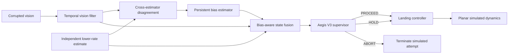

<div align="center">

# AegisLand

### Redundant Perception Safety for Simulated Autonomous UAV Landing

> **When one perception stream is confidently wrong, can independent evidence keep the system from acting on the error?**

[](https://github.com/suhaslord/uav-safety-research/actions/workflows/ci.yml)


**A reproducible simulation study of uncertainty, persistent perception bias, redundant estimation, and safety–availability tradeoffs.**

</div>

---

## Frozen V3 result

The held-out V3 benchmark used **500 paired episode seeds per profile/architecture cell**, for **10,000 simulated landing episodes** total.

| Profile | Baseline unsafe | V2 unsafe | **V3 unsafe** | **V3 success** | V3 abort |
|---|---:|---:|---:|---:|---:|
| clean | 0.0% | 0.0% | **0.0%** | **100.0%** | 0.0% |
| blur | 0.0% | 0.0% | **0.0%** | **100.0%** | 0.0% |
| low light | 0.0% | 0.2% | **0.0%** | **100.0%** | 0.0% |
| occlusion | 34.6% | 33.6% | **1.4%** | **98.6%** | 0.0% |
| **mixed** | **84.2%** | **84.0%** | **2.4%** | **97.6%** | **0.0%** |

Under the primary `mixed` stress profile, V3 reduced the observed unsafe-touchdown rate by **81.8 percentage points** versus baseline, approximately **97.1% relative** in this simulation.

Under `occlusion`, V3 reduced the observed unsafe-touchdown rate by **33.2 percentage points**, approximately **96.0% relative**.

### 95% Wilson intervals for V3

- `mixed` success: **95.85%–98.62%**
- `mixed` unsafe touchdown: **1.38%–4.15%**
- `occlusion` success: **97.14%–99.32%**
- `occlusion` unsafe touchdown: **0.68%–2.86%**

Full frozen results: [`docs/v3_results.md`](docs/v3_results.md)  
Raw committed outputs: [`results/v3_frozen/`](results/v3_frozen/)

> **Important:** these are simulation results, not real-aircraft safety claims.

---

## The research story

AegisLand was intentionally developed through measured failures instead of deleting old results when they looked bad.

| Version | Main idea | What the experiment taught us |
|---|---|---|
| **Baseline** | always continue landing | easy conditions are fine; severe bias/noise causes unsafe touchdowns |
| **V1** | static confidence/risk thresholds | safety can improve by simply becoming unusably conservative |
| **V2** | temporal filtering + persistence + hysteresis | availability recovers, but persistent bias remains unidentifiable from one stream |
| **V3** | independent redundant estimate + bias-aware fusion | held-out simulation result strongly reduces the persistent-bias failure without returning to excessive aborts |

That progression changed the project from a threshold-tuning exercise into an **observability problem**:

> If one sensor stream is consistently wrong, does the autonomy stack need independent error structure to know that it is wrong?

---

## Paired episode evidence

All architectures were compared using paired episode seeds.

### Mixed degradation

- **410** baseline unsafe episodes became V3 successes
- **1** baseline success became V3 unsafe
- **409** V2 unsafe episodes became V3 successes
- **1** V2 success became V3 unsafe

### Occlusion

- **166** baseline unsafe episodes became V3 successes
- **0** baseline successes became V3 unsafe
- **161** V2 unsafe episodes became V3 successes
- **0** V2 successes became V3 unsafe

This matters because the aggregate improvement is not merely hiding an equal number of new failures elsewhere.

---

## V3 architecture



The independent reference estimate is intentionally imperfect:

- lower update rate than vision
- independent zero-mean noise
- missed updates
- uncertainty growth between updates
- isolated RNG stream

V3 therefore does **not** get a perfect ground-truth controller input.

---

## What V3 adds

### Persistent-bias estimation

Fresh cross-estimator disagreement is accumulated over time. Strong correction is applied only when the estimated offset is persistent, large enough to matter, and statistically distinguishable from ordinary disagreement noise.

### Bias-aware fusion

The control-side estimate combines:

1. temporally filtered vision,
2. confidence-gated lateral bias correction,
3. a modest independent-reference contribution.

The strongest redundant-estimator influence is applied to lateral position because persistent lateral bias was the measured V2 failure mode.

### Explained vs unexplained disagreement

A stable, estimable bias is treated differently from disagreement that remains unexplained near touchdown. This avoids recreating the V1 failure mode where uncertainty simply caused near-universal aborts.

---

## Reproducibility safeguards

- deterministic top-level seeds
- paired architecture comparisons
- isolated V3 reference RNG
- development/frozen seed separation
- frozen V3 algorithm before held-out evaluation
- raw episode-level CSV output
- 95% Wilson intervals
- paired-effect analysis
- automated dataset validator
- unit tests + compile checks
- GitHub Actions CI smoke benchmark
- historical V1/V2 results retained
- explicit limitations and safety scope

See:

- [`docs/reproducibility.md`](docs/reproducibility.md)
- [`docs/v3_freeze.md`](docs/v3_freeze.md)
- [`docs/v3_results.md`](docs/v3_results.md)

---

## Reproduce the frozen evaluation

```bash
git clone https://github.com/suhaslord/uav-safety-research.git
cd uav-safety-research
python -m venv .venv
```

Activate the environment, then:

```bash
pip install -e ".[dev]"
pytest -q
```

Run the frozen benchmark:

```bash
python scripts/run_v3_comparison.py --episodes 500 --seed 424242 --out results/v3_frozen
```

Validate it:

```bash
python scripts/validate_v3_frozen.py --out results/v3_frozen --seed 424242 --episodes 500
```

Expected validation summary:

```text
V3 frozen result validation: PASS
seed: 424242
episodes per cell: 500
total rows: 10000
```

---

## Experimental profiles

| Profile | Stressors | Role |
|---|---|---|
| `clean` | low noise | control condition |
| `blur` | moderate state noise | mild degradation |
| `low_light` | uncertainty + moderate bias | visibility-like stress surrogate |
| `occlusion` | dropout + noise + bias | partial-observation surrogate |
| `mixed` | strongest noise + dropout + persistent bias | primary V3 stress test |

These are **abstract simulation stress profiles**, not calibrated camera models.

---

## Repository map

```text
uav-safety-research/
├── src/uav_safety/
│   ├── dynamics.py
│   ├── perception.py
│   ├── controller.py
│   ├── supervisor.py
│   ├── supervisor_v2.py
│   ├── supervisor_v3.py
│   ├── reference_estimator.py
│   ├── simulator.py
│   ├── simulator_v2.py
│   ├── simulator_v3.py
│   └── metrics.py
├── scripts/
│   ├── run_experiments.py
│   ├── run_threshold_sweep.py
│   ├── run_v2_comparison.py
│   ├── run_v3_comparison.py
│   └── validate_v3_frozen.py
├── results/
│   ├── threshold_sweep/
│   ├── v2_comparison/
│   ├── v3_development/
│   └── v3_frozen/
├── tests/
├── docs/
└── paper/
```

---

## Limitations

The frozen result is strong **inside this simulation**, but external validity is intentionally limited.

Current limitations include:

- planar dynamics rather than a full 6-DOF aircraft model
- synthetic perception degradation rather than calibrated camera physics
- abstract redundant estimator rather than a modeled physical sensor
- synthetic wind/disturbance field
- no image-based perception front end in V3
- no hardware or flight validation
- one frozen evaluation seed family

The next serious scientific question is therefore whether the result survives **multi-seed sensitivity analysis and more realistic perception**, not whether more threshold tuning can make the current table look even better.

---

## Paper workspace

A first result-grounded abstract is available at [`paper/abstract.md`](paper/abstract.md).

The write-up is being built from committed experiment artifacts rather than reconstructed from memory.

---

## Safety scope

**AegisLand is not flight-control software.**

It is an educational, simulation-only research project. It is not validated for physical aircraft and should not be used to operate one.

---

## Author

**Suhas Beemineni**  
River Islands High School

Interested in aerospace engineering, autonomous systems, AI reliability, computational engineering, and research.

Technical criticism, methodology review, and reproducibility feedback are welcome.
