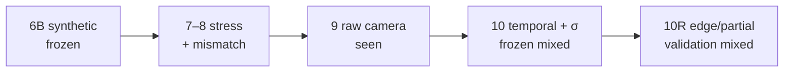

<div align="center">

# AegisLand

**External perception evidence you can inspect — not just trust.**

[](https://github.com/suhaslord/uav-safety-research/actions/workflows/ci.yml)


Simulation research on perception overconfidence, calibrated abstention, redundant estimation, and PX4/Gazebo camera evidence limits.

> If visual perception is internally consistent but systematically wrong, can independent evidence expose the error without making landing unusably conservative?

| [Live archive](https://aegisland-research-cockpit.vercel.app/) | [Phase 10R validation](docs/phase10r_development_validation_result.md) | [Phase 10 result](docs/phase10_frozen_holdout_result.md) | [10R preregistration](docs/phase10r_preregistration.md) |
| :---: | :---: | :---: | :---: |

</div>

---

## Current frontier — Phase 10R mixed validation result

The preregistered Phase 10R candidate was frozen at `e1d566f8baa47bf10f9bdf39dd5988724208be80` **before** the trajectory-held-out validation seed was exposed. On 1,200 truth-visible validation frames, Phase 10R recovered difficult edge/partial/stressed observations much more often and retained strong uncertainty calibration, but its lateral pose improvement did not reach the preregistered magnitude gates. The mixed result is preserved without post-validation retuning.

| Validation gate | Result | Reading |
|---|:---:|---|
| Difficult miss rate | **PASS** | `25.70% → 8.72%` · **66.0% relative reduction** |
| False positives | **PASS** | `0.0%` |
| Detected-center p95 ≤ 1.10× baseline | **FAIL** | `1.1265×` |
| Lateral MAE improvement ≥ 40% | **FAIL** | **30.1%** improvement |
| Lateral p95 improvement ≥ 30% | **FAIL** | **15.2%** improvement |
| Altitude MAE / p95 improvement | **PASS** | **53.0% / 44.9%** improvement |
| 95% uncertainty coverage | **PASS** | **94.1% lateral / 94.1% altitude** |
| Mean absolute coverage error ≤ 5 pp | **PASS** | **0.84 pp** |

The next protected `phase10r_frozen_holdout` is **not exposed**. The preregistration requires a second explicit approval at the exact freeze checkpoint before that can happen.

---

## Phase 10 frozen mixed result

AegisT10 **did not beat** Phase 9 point estimates on the Gazebo-camera holdout. Every usable observation was already clean ArUco geometry at centimeter scale, so temporal filtering had nothing catastrophic to rescue. **Uncertainty honesty improved sharply** on the same paired rows. The mixed result was frozen; nothing was retuned after exposure.


| Metric | Phase 9 | AegisT10 | Reading |
|---|---:|---:|---|
| Lateral / altitude MAE | `2.77 / 1.57 cm` | `2.77 / 1.57 cm` | matched · point-error gate `FAIL` |
| Median \|residual\| / σ (lat / alt) | `13.17 / 5.11` | **`0.65 / 0.52`** | overconfident → near σ-honest |
| 2σ coverage (lat / alt) | — | **`93% / 100%`** | calibrated uncertainty held |
| Holdout | 65 raw · 20 visible · 15 obs · 5 misses · 0 FP | **15 ArUco · 0 fallback** | why the temporal win did not transfer |

| Gate | Result | Detail |
|---|:---:|---|
| Metric availability drop ≤ 2 pp | `PASS` | no availability loss vs Phase 9 |
| No false-positive regression | `PASS` | 0 false positives |
| Median norm. residual < 2 (both axes) | `PASS` | 0.65 lateral · 0.52 altitude |
| ≥50% MAE / ≥35% p95 reduction | `FAIL` | ArUco-only holdout left no point-error to rescue |

Phase 10R was motivated by the five truth-visible Phase 10 misses (`27, 35, 36, 46, 47`), but those historical frames were used only for descriptive forensics—not model selection. The new development/validation evidence is documented in [the frozen Phase 10R result](docs/phase10r_development_validation_result.md).

<a href="https://aegisland-research-cockpit.vercel.app/">
  
</a>

<p align="center"><sub>Live cockpit · <code>safety_acceptance = false</code></sub></p>

---

## Earlier frozen milestones

### Phase 6B — selective confidence


| Architecture | Success | Unsafe | vs image-only |
|---|---:|---:|---|
| Image-only temporal | `57%` | `43%` | — |
| Phase 6 Aegis | `94%` | `6%` | +37 pp success · −37 pp unsafe |
| **Phase 6B selective** | **`99%`** | **`1%`** | +42 pp success · −42 pp unsafe |

Low-light Phase 6B kept a deliberate **3% timeout** cost.

### V3 — abstract redundant perception


| Architecture | Unsafe | Success | Lesson |
|---|---:|---:|---|
| Baseline | `84.2%` | `15.8%` | persistent visual bias remains dangerous |
| V2 temporal | `84.0%` | `16.0%` | smoothing does not expose single-stream bias |
| **V3 redundant** | **`2.4%`** | **`97.6%`** | independent error structure can expose the bias |

---

## Evidence ladder



| # | Layer | Status | What it supports |
|:---:|---|---|---|
| `6B` | Synthetic landing + selective confidence | `frozen held-out` | defined synthetic benchmark result |
| `7` | External-validity stress factorial | `audited / seen` | where redundancy assumptions break |
| `8` | PX4/Gazebo trace comparison | `external seen` | resemblance = `diagnostic_mismatch` |
| `9` | Genuine Gazebo camera evidence | `external perception seen` | strong detection ≠ trustworthy metric geometry |
| `10` | Temporal metric + calibrated σ | `frozen holdout` | uncertainty improved; point-error gate failed |
| `10R` | Edge/partial-view generalization | `trajectory-held-out validation seen` | availability + altitude + uncertainty improved; lateral gates remained below target |
| — | New 10R protected holdout | `not exposed` | second explicit approval required |
| — | Physical aircraft | `not tested` | no hardware or flight validation |

**Nothing here is a physical-flight safety acceptance.**  
`safety_acceptance = false` · `controller_tuning_allowed = false` · simulation only.

---

## Quickstart

```bash
git clone https://github.com/suhaslord/uav-safety-research.git
cd uav-safety-research
python -m venv .venv
# macOS / Linux: source .venv/bin/activate
# Windows PowerShell: .\.venv\Scripts\Activate.ps1
pip install -e ".[dev]"
pytest
python scripts/serve_dashboard.py   # http://127.0.0.1:8765
```

Live archive: [aegisland-research-cockpit.vercel.app](https://aegisland-research-cockpit.vercel.app/)

---

## Limitations

| Limit | Why it matters |
|---|---|
| Simulation only | No hardware-camera or physical-flight validation |
| Phase 10R validation is now seen | Seed `271828` cannot be reused as a hidden test |
| Lateral partial-view geometry missed gates | Availability gains did not translate into the preregistered lateral error reduction |
| Small Phase 10 holdout | **20** truth-visible · **15** paired observations |
| Historical Phase 10 holdout now seen | Cannot be a hidden Phase 10R test |
| Short Phase 8 external trace | Genuine `diagnostic_mismatch`, not a pass |
| CI green ≠ flight-safe | Passing tests ≠ UAV safety acceptance |

---

## Safety

**AegisLand is not validated flight-control software.** Educational / simulation-only. Do not use it to operate a physical aircraft.

---

<div align="center">

**Suhas Beemineni** · River Islands High School

Aerospace · autonomous systems · AI reliability · reproducible research

</div>
