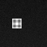
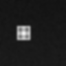
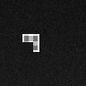

# AegisLand

**Simulation research on UAV landing when visual perception becomes unreliable.**

[](https://github.com/suhaslord/uav-safety-research/actions/workflows/ci.yml)
[](https://aegisland-research-cockpit.vercel.app/)

[Research cockpit](https://aegisland-research-cockpit.vercel.app/) · [Experiment archive](https://aegisland-research-cockpit.vercel.app/phases/) · [Project guide](docs/project_understanding_guide.md)

AegisLand asks a simple question: **when a landing system sees degraded perception, can it recognize when its estimate should not be trusted?**

## Benchmark inputs

The Phase 5 image benchmark uses **96×96 synthetic grayscale landing-pad images**. These examples are generated by the same renderer and conditions used by the benchmark.

<table>
  <tr>
    <th>Clean</th>
    <th>Blur</th>
    <th>Low light</th>
    <th>Occlusion</th>
    <th>Mixed</th>
  </tr>
  <tr>
    <td></td>
    <td></td>
    <td></td>
    <td></td>
    <td></td>
  </tr>
</table>

The benchmark generates **300 images per condition — 1,500 total** — from randomized lateral offsets and altitudes. It is a controlled synthetic benchmark, not real-camera validation.

## Pipeline

```text
state → synthetic image → degradation → estimator → confidence + position → safety decision
```

| Block | Input | Output |
| --- | --- | --- |
| Renderer | lateral offset + altitude | 96×96 grayscale image |
| Degradation | clean image | stressed image |
| Estimator | grayscale image | lateral estimate + confidence + valid/invalid |
| Supervisor | estimate + confidence/risk signals | continue, hold, or abort |

The current research focus is to understand and document **each block's input, output, assumptions, and handoff** before adding deeper models or more complicated mathematics.

## Current baseline

The pixel estimator is **rule-based, not a neural network**. It thresholds bright pixels and uses a brightness-weighted horizontal centroid to estimate the landing pad's lateral position.

**Tools:** NumPy · pandas · Matplotlib

Implementation: [`src/uav_safety/image_perception.py`](src/uav_safety/image_perception.py)

## Phase 5 result

| Condition | Valid | Mean error | P95 error | Mean confidence |
| --- | ---: | ---: | ---: | ---: |
| Clean | 100% | 0.017 m | 0.031 m | 0.833 |
| Blur | 100% | 0.016 m | 0.030 m | 0.783 |
| Low light | 100% | 0.074 m | 0.255 m | 0.636 |
| Occlusion | 100% | 0.082 m | 0.194 m | 0.818 |
| Mixed | 100% | **0.344 m** | **1.002 m** | 0.518 |

**Main observation:** mixed degradation increased the mean error to **0.344 m**, but the estimator still marked **every sample as valid**.

That shifts the question from *“does the image look better?”* to **“does the system know when its estimate is unreliable?”**

## Quick start

```bash
git clone https://github.com/suhaslord/uav-safety-research.git
cd uav-safety-research
python -m pip install -e ".[dev]"
python scripts/run_image_perception_benchmark.py --samples 300 --seed 606060 --out results/image_perception
```

The benchmark writes the raw samples, summary table, plots, and a five-condition example figure to `results/image_perception/`.

Run the test suite with:

```bash
pytest -q
```

## Research record

The full experimental history is preserved through **Phase 22**, including failed phases rather than rewriting them after later experiments succeed.

- [Experiment archive](https://aegisland-research-cockpit.vercel.app/phases/)
- [Project understanding guide](docs/project_understanding_guide.md)
- [Block-level reference map](docs/block_reference_map.md)
- [Methodology](docs/methodology.md)
- [Reproducibility](docs/reproducibility.md)

## Scope

AegisLand is **simulation-only research**. The current image benchmark is synthetic and is not calibrated to real camera physics. Results do not establish physical-flight safety, certification, or production readiness.
