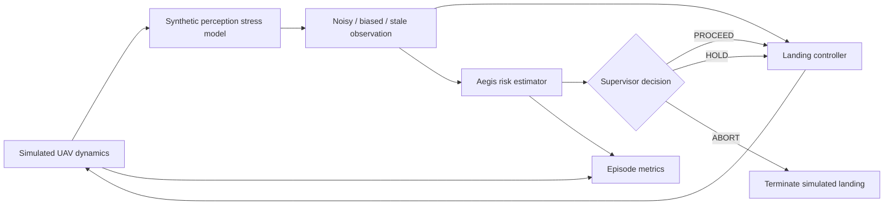

<div align="center">

# AegisLand

### Confidence-Aware Safety Supervision for Vision-Based Autonomous UAV Landing

**A simulation-first research project asking a simple safety question:**

> When an autonomous aircraft's perception becomes unreliable, should it keep landing?

[](https://github.com/suhaslord/uav-safety-research/actions/workflows/ci.yml)


</div>

---

## Research question

**Can an uncertainty-aware supervisory layer reduce unsafe simulated UAV landings caused by degraded visual perception without causing an impractically high intervention or abort rate?**

Most autonomy stacks are optimized around *getting the estimate right*. AegisLand studies the next question:

**What should the system do when it knows the estimate may be wrong?**

The project compares two architectures:

| System | Behavior under uncertain perception |
|---|---|
| **Baseline** | Continues the landing using the current estimate |
| **Aegis Supervisor** | Uses confidence + uncertainty + flight state to `PROCEED`, `HOLD`, or `ABORT` |

No result is assumed in advance. The experiment runner preserves raw episode data and the threshold-sweep tool is designed to expose the tradeoff between **safety** and **availability**, rather than cherry-picking a single threshold.

---

## System architecture



### Current phase: isolate the safety decision layer

The first version intentionally does **not** claim to model a real camera. Instead, it introduces controlled perception failures:

- measurement noise
- lateral bias
- stale observations / dropout
- imperfect confidence estimates
- mixed degradation

This lets the project isolate a hard research question before adding a computer-vision model:

> **Can downstream autonomy use uncertainty well enough to avoid acting confidently on bad perception?**

See [`docs/methodology.md`](docs/methodology.md) for the exact assumptions.

---

## What makes this more than a demo

### 1. Repeated Monte Carlo trials

Each condition is run across many randomized episodes with deterministic seeds.

### 2. Raw data first

Every episode is stored in CSV. Aggregate figures are generated from the same data.

### 3. Confidence intervals

Success and unsafe-touchdown rates are reported with **95% Wilson intervals**.

### 4. Threshold ablation

Instead of declaring one supervisor threshold "best", the project sweeps thresholds and plots a **safety–availability frontier**.

### 5. Explicit limitations

The current perception model is a *surrogate stress model*, not calibrated optics. That limitation is written into the methodology instead of hidden.

### 6. Reproducible code

The repository includes tests and GitHub Actions CI.

---

## Quick start

```bash
git clone https://github.com/suhaslord/uav-safety-research.git
cd uav-safety-research

python -m venv .venv
```

Activate the environment, then:

```bash
pip install -e ".[dev]"
pytest -q
```

### Run one visual demo

```bash
python scripts/run_demo.py
```

This compares baseline and supervised trajectories using the same random seed.

### Run the main experiment

```bash
python scripts/run_experiments.py --episodes 100 --seed 2026
```

Outputs are written to `results/latest/`:

```text
episodes.csv
summary.csv
summary.md
success_rate.png
unsafe_touchdown_rate.png
run_metadata.json
```

### Run the supervisor ablation

```bash
python scripts/run_threshold_sweep.py --episodes 60 --profile occlusion
```

This creates a **safety–availability frontier** showing where reducing unsafe touchdowns begins to cost too many successful landings.

---

## Experimental matrix

Five perception-stress conditions are currently implemented:

| Profile | Main stressors | Intended role |
|---|---|---|
| `clean` | low noise | control condition |
| `blur` | moderate state noise | mild degradation |
| `low_light` | higher uncertainty + bias | degraded visibility surrogate |
| `occlusion` | dropout + uncertainty + bias | partial-observation surrogate |
| `mixed` | strongest combined stress | worst-case stress test |

Each profile is tested against both:

- baseline controller
- confidence-aware supervised controller

Primary outcome:

**unsafe touchdown rate**

Secondary outcomes:

- successful landing rate
- abort rate
- final horizontal error
- touchdown velocity
- intervention count
- mean / maximum predicted risk

---

## Repository map

```text
uav-safety-research/
├── src/uav_safety/
│   ├── dynamics.py       # planar UAV model
│   ├── perception.py     # controlled perception degradation
│   ├── controller.py     # landing controller
│   ├── supervisor.py     # confidence-aware safety layer
│   ├── simulator.py      # episode engine
│   ├── metrics.py        # safety metrics + confidence intervals
│   └── experiment.py     # reproducible Monte Carlo runner
├── scripts/
│   ├── run_demo.py
│   ├── run_experiments.py
│   └── run_threshold_sweep.py
├── tests/
├── docs/
│   ├── research_plan.md
│   ├── methodology.md
│   ├── literature.md
│   └── ethics_and_safety.md
└── paper/
```

---

## Research roadmap

### Phase 1 — Safety supervisor
- [x] reproducible planar landing simulation
- [x] baseline landing controller
- [x] controlled perception degradation
- [x] interpretable confidence-aware supervisor
- [x] Monte Carlo evaluation pipeline
- [x] Wilson confidence intervals
- [x] safety–availability threshold sweep
- [x] automated tests + CI
- [ ] freeze v1 experiment parameters
- [ ] run full preregistered experiment

### Phase 2 — Image-based perception
- [ ] create a synthetic landing-pad image dataset
- [ ] apply controlled blur, low contrast, masking, and sensor noise
- [ ] estimate landing-pad position from pixels
- [ ] measure confidence calibration
- [ ] connect image-estimation uncertainty to the supervisor

### Phase 3 — Research-grade evaluation
- [ ] temporal-consistency supervisor
- [ ] confidence-only ablation
- [ ] uncertainty-only ablation
- [ ] calibration curves / reliability diagrams
- [ ] multi-seed sensitivity analysis
- [ ] failure-case gallery
- [ ] statistical write-up

### Phase 4 — Paper / poster
- [ ] related-work review
- [ ] methods figure
- [ ] results tables
- [ ] limitations section
- [ ] research poster
- [ ] short technical paper

---

## Hypothesis

> Under degraded perception, explicitly using uncertainty in the autonomy decision layer will reduce unsafe simulated touchdowns compared with a controller that always continues landing, but overly conservative thresholds may trade safety for excessive holds or aborts.

That second half matters. A supervisor that simply refuses to land every time is not a useful solution.

The project therefore studies **both sides of the tradeoff**.

---

## Literature starting point

The project is informed by research on uncertainty-aware UAV navigation, vision-based landing, and risk-aware landing systems. The literature map is maintained in [`docs/literature.md`](docs/literature.md).

Starting references include:

- Arnez et al., *Quantifying and Using System Uncertainty in UAV Navigation* (2022)
- Dong, *Vision-based control for landing an aerial vehicle on a marine vessel* (2024)
- de la Torre-Vanegas et al., *Vision-Based Risk Aware Emergency Landing for UAVs in Complex Urban Environments* (2025)
- Chen et al., *Robust Autonomous Landing of UAV in Non-Cooperative Environments based on Dynamic Time Camera-LiDAR Fusion* (2020)

---

## Safety scope

**AegisLand is not flight-control software.**

It is an educational, simulation-first research project and is not validated for physical aircraft. See [`docs/ethics_and_safety.md`](docs/ethics_and_safety.md).

The goal is to study **when autonomous perception should not be trusted**, not to provide instructions for operating a real UAV.

---

## Author

**Suhas Beemineni**  
River Islands High School  
Interested in aerospace engineering, autonomous systems, AI reliability, computational engineering, and research.

If you're a researcher working in UAV autonomy, controls, perception uncertainty, robotics, or aerospace systems, technical criticism of the methodology is very welcome.
