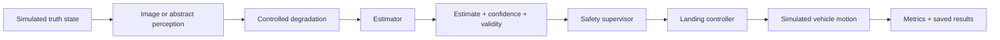

# AegisLand block-level reference map

This document turns the current research pipeline into explicit blocks. The goal is to understand the system **at a high level first**: what enters each block, what the block does, what leaves it, what it depends on, and where to go when a deeper explanation is needed.

The rule for the current stage of the project is simple:

> If a block cannot be explained clearly to a non-technical person, its documentation is not finished yet.

Detailed optics, advanced computer-vision theory, and formal paper development are intentionally deferred until the system-level explanation is solid.

---

## 1. Full system contract



The important interaction is that each block has a **contract**. The next block should only depend on the previous block's documented output, not on an unexplained hidden assumption.

For the pixel benchmark, the main contract is:

```text
true lateral offset + altitude
        ↓
96×96 float grayscale image in [0, 1]
        ↓
degraded 96×96 image
        ↓
lateral estimate + confidence + valid/invalid
        ↓
error / validity / confidence metrics
```

For the landing-system experiments, the contract continues into the supervisor and controller.

---

## 2. Block map

| Block | Purpose | Input | Transformation | Output | Main interaction |
|---|---|---|---|---|---|
| Simulated truth | provide known ground truth | scenario/vehicle state | simulation update | true position/altitude/velocity | lets later blocks be measured against truth |
| Synthetic image renderer | create a controlled visual observation | lateral offset, altitude, random seed | draw landing-pad scene | 96×96 grayscale image | supplies a repeatable image to degradation |
| Degradation | create a controlled distribution shift | clean image + condition/severity | blur, dimming, occlusion, noise/mixed changes | degraded image | changes what the estimator sees while truth stays known |
| Threshold estimator | produce a simple perception estimate | degraded image | threshold bright pixels + weighted centroid | lateral estimate, confidence, validity | converts pixels into a quantity the rest of the system can use |
| Abstract perception | test system behavior without pixels | true state + stress profile | controlled noise/bias/dropout/staleness | perceived state + confidence | isolates system-level safety behavior from pixel details |
| Safety supervisor | decide whether evidence is trustworthy enough | estimate + confidence/risk/uncertainty | fixed decision logic | proceed/hold/abort | determines whether the controller is allowed to continue normally |
| Controller | turn perceived state into motion | perceived state + supervisor decision | simulated control law | motion command | drives the next simulated vehicle state |
| Metrics/results | make experiments comparable | truth, estimate, decisions, outcomes | aggregate errors/rates/coverage | CSVs, tables, plots, verdicts | turns runs into auditable evidence |

---

## 3. What must be documented for every block

Every component should answer the same questions:

1. **Purpose:** Why is this block here?
2. **Input:** What exact information enters it? Include units/shapes when useful.
3. **Transformation:** What does it actually do, in plain language first and code/math second?
4. **Output:** What leaves the block?
5. **Interaction:** Which later block consumes that output, and how?
6. **Assumptions:** What simplifications are being made?
7. **Failure behavior:** What can go wrong or become misleading?
8. **Code pointer:** Where is the implementation?
9. **Evidence pointer:** Which experiment/result tests it?
10. **Reference:** Which external documentation, textbook, or paper should be read before going deeper?

That template should be used whenever another component is added.

---

## 4. Current block references

These are learning references, not evidence that AegisLand implements every feature described by the source.

### Numerical arrays and image operations

**Used for:** synthetic frames, thresholds, masks, centroids, noise, and numerical calculations.

- NumPy documentation: https://numpy.org/doc/stable/
- NumPy random sampling: https://numpy.org/doc/stable/reference/random/index.html

**What to understand now:** arrays, shapes, indexing, masks, means/percentiles, deterministic random seeds.

**Leave for later:** advanced linear algebra unless a future research question actually needs it.

### Experiment tables

**Used for:** storing per-image/per-episode results and aggregating conditions.

- pandas documentation: https://pandas.pydata.org/docs/
- pandas DataFrame guide: https://pandas.pydata.org/docs/user_guide/dsintro.html

**What to understand now:** rows vs columns, filtering/grouping, reading/writing CSVs, and how a metric is produced from individual trials.

### Plots

**Used for:** visualizing error, failure rate, confidence, and comparisons.

- Matplotlib documentation: https://matplotlib.org/stable/

**What to understand now:** which variables are on each axis, what one point/bar represents, and whether the plot summarizes mean, percentile, rate, or another metric.

### Blur as an image-processing block

The current pixel benchmark uses repeated small box-blur passes. It is an experimental degradation, **not a calibrated model of one physical camera failure**.

Useful background:

- OpenCV smoothing concepts: https://docs.opencv.org/4.x/d4/d13/tutorial_py_filtering.html
- SciPy convolution reference: https://docs.scipy.org/doc/scipy/reference/generated/scipy.signal.convolve2d.html

AegisLand does not currently require OpenCV to implement its estimator; the references are for understanding the general concept of spatial filtering.

### Thresholding / centroid estimation

The current estimator identifies bright support pixels and computes a brightness-weighted horizontal center. It is intentionally a simple rule-based baseline.

Useful background:

- scikit-image thresholding overview: https://scikit-image.org/docs/stable/auto_examples/applications/plot_thresholding_guide.html
- image moments/centroid concept in OpenCV: https://docs.opencv.org/4.x/dd/d49/tutorial_py_contour_features.html

**What to understand now:** why thresholding chooses candidate pixels, why a weighted center estimates location, and why confidence/validity can be misleading.

### Research structure and reproducibility

- NeurIPS paper checklist/guidelines: https://neurips.cc/Conferences/2026/PaperInformation/PaperChecklist
- ACM artifact review/reproducibility terminology: https://www.acm.org/publications/policies/artifact-review-and-badging-current

**What to learn now:** how technical work is organized into problem, data, method, experiment, result, limitations, and references.

**What not to do now:** force the project into a paper before the system can be explained clearly.

---

## 5. Interaction checks

Understanding individual blocks is not enough; the handoffs must also be clear.

### Renderer → degradation

- Same image shape in and out.
- Pixel range should remain defined.
- Truth should not silently change when only the observation is degraded.

### Degradation → estimator

- The estimator should not secretly know which degradation was applied unless the experiment explicitly allows that information.
- Severity should be controlled by the experiment configuration, not adjusted after seeing the result.

### Estimator → supervisor

- Estimate, confidence, and validity are separate outputs.
- A valid output is not automatically an accurate output.
- The mixed-degradation Phase 5 result is a concrete example: the estimator stayed valid while error grew substantially.

### Supervisor → controller

- The intervention rule should be fixed before evaluation.
- “Hold” or “abort” should not be counted as successful landing accuracy; they are different outcomes.

### Metrics → conclusion

- Every headline claim should map to an actual saved metric.
- Failed preregistered gates remain failures.
- Later results do not rewrite earlier negative results.

---

## 6. Non-technical explanation test

Before adding a new research phase, the project owner should be able to answer these without opening the code:

- What problem is the project trying to solve?
- What does the system receive as input?
- What are the major blocks from input to decision?
- What does each block output?
- What does “blur,” “low light,” “occlusion,” or “mixed” actually mean in this experiment?
- What is the current estimator doing in one or two sentences?
- What data are real, synthetic, or simulated?
- What result was most important, and what does it **not** prove?
- What failed?
- Why is the next experiment logically connected to the previous one?

If any answer requires vague wording such as “AI does it” or “the algorithm figures it out,” that block needs more documentation.

---

## 7. How to organize a research update

Use the same short structure every time:

### Problem
What specific question is being tested?

### Data
Exactly what images/runs/splits are used? Which are synthetic, simulated, development, transfer, protected, or final?

### Method
What blocks are used and what is frozen before evaluation?

### Experiment
What is changed, what stays fixed, and what comparison is made?

### Metrics
What measurements decide whether the result passes or fails?

### Result
What actually happened, including negative results?

### Limitation
What can this experiment not establish?

### Next step
What single question follows from this result?

This is intentionally paper-like organization without claiming the current project is ready to be a paper.

---

## 8. Future research parking lot

These ideas are worth keeping, but they are **not current requirements**:

- physically characterize one degradation such as motion blur;
- connect a degradation to camera exposure, vibration, optics, or sensor failure parameters;
- replace the rule-based estimator with a learned vision baseline and compare fairly;
- use real-camera data with a documented ground-truth protocol;
- study whether a narrow result is strong enough for a formal paper/project.

Those should be revisited after stronger linear algebra/calculus/probability background and after the existing pipeline can be explained cleanly block by block.

---

## 9. Definition of “ready to go deeper”

A component is ready for deeper study when all of these are true:

- its input and output are explicit;
- its implementation can be explained in plain language;
- its assumptions and limitations are written down;
- the code pointer is known;
- its result is reproducible;
- its interaction with neighboring blocks is understood;
- at least one reliable external resource is linked;
- the reason deeper analysis would improve the research question is clear.

Until then, the priority is **understanding, documentation, and organization**, not extra complexity.
