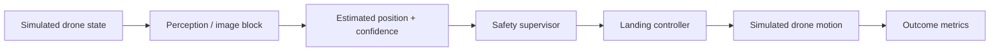
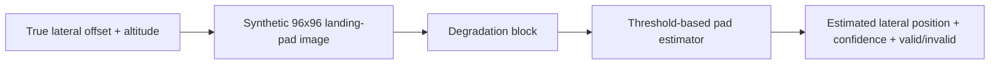

# AegisLand project understanding guide

This document is the **start-here explanation of the project at a block level**. The goal is to be able to explain each part clearly before adding more complexity.

## 1. The project in plain English

AegisLand studies a simple safety question:

> If a drone's landing perception becomes unreliable, can the system notice that before it trusts a bad estimate too much?

The project is simulation-only. It does not fly a real drone and does not prove real-world flight safety.

A simple way to explain it to a non-technical person:

> A drone needs to estimate where it is relative to a landing area. I simulate cases where that estimate gets worse because of things such as blur-like degradation, low light, occlusion, noise, bias, or stale observations. Then I compare a normal landing system with a safety-supervised version that can slow down, hold, or abort when the estimate looks untrustworthy.

## 2. High-level pipeline

For the pixel-based image benchmark, the perception block can be expanded as:

## 3. What goes into and comes out of each block

| Block | Input | What it does | Output | Main code |
|---|---|---|---|---|
| Drone simulation | position, altitude, velocity | updates simulated motion | new state | `src/uav_safety/dynamics.py`, simulator files |
| Abstract perception | true state + selected stress profile | adds controlled noise, bias, dropout/staleness and imperfect confidence | perceived state + confidence | `src/uav_safety/perception.py` |
| Synthetic image renderer | lateral offset, altitude, condition, severity | creates a simple 96x96 grayscale landing-pad image and applies a visual degradation | grayscale image | `src/uav_safety/image_perception.py` |
| Pad estimator | grayscale image | thresholds bright pixels and computes a weighted centroid | lateral estimate, confidence, validity | `ThresholdPadEstimator` in `image_perception.py` |
| Safety supervisor | perceived state, confidence, uncertainty/risk signals | decides whether to proceed, hold, or abort | safety decision | supervisor modules |
| Controller | perceived state + safety decision | generates the landing command used by the simulator | commanded motion | `src/uav_safety/controller.py` and simulator files |
| Metrics | completed simulated episode | measures success, unsafe touchdown, error, aborts, etc. | summary results | `src/uav_safety/metrics.py`, experiment scripts |

## 4. What "blur" currently means

There are two different uses of degradation names in the repository, and they should not be mixed up.

### Abstract perception profile

In `src/uav_safety/perception.py`, names such as `blur`, `low_light`, `occlusion`, and `mixed` are **shorthand stress profiles**. They change quantities such as position noise, velocity noise, dropout probability, lateral bias, and confidence. They are not physical camera models.

### Pixel-based image benchmark

In `src/uav_safety/image_perception.py`, `blur` is implemented as repeated **3x3 box-blur passes** over the synthetic grayscale frame. The number of passes increases with the severity setting.

This is intentionally simple. It should be described as a controlled blur-like degradation, **not** as a calibrated model of drone vibration, lens defocus, water on a lens, or a specific real camera failure.

## 5. What the image "detector" actually is

The current pixel front end is **not a neural network** and it does not use OpenCV.

The `ThresholdPadEstimator` is an interpretable classical image-processing baseline:

1. measure the image median, standard deviation, and 90th percentile;
2. create a threshold from those statistics;
3. select pixels above the threshold;
4. compute a brightness-weighted horizontal centroid;
5. convert that centroid into an estimated lateral offset;
6. compute a simple confidence score using image contrast and the amount of supporting pixels.

The main libraries used by this benchmark are:

- NumPy
- pandas
- Matplotlib

## 6. What the dataset is

The first pixel benchmark does **not** use an external real-world dataset.

It generates synthetic 96x96 grayscale landing-pad frames from randomized lateral offsets and altitudes. In the Phase 5 benchmark:

- 5 conditions were used: clean, blur, low light, occlusion, mixed;
- 300 images were generated per condition;
- 1,500 images were evaluated total.

That makes this a controlled synthetic benchmark, not a real-camera validation.

## 7. Current pixel-benchmark result

Phase 5 reported:

| Condition | Valid estimates | Mean absolute lateral error | 95th-percentile error | Mean confidence |
|---|---:|---:|---:|---:|
| Clean | 100% | 0.017 m | 0.031 m | 0.833 |
| Blur | 100% | 0.016 m | 0.030 m | 0.783 |
| Low light | 100% | 0.074 m | 0.255 m | 0.636 |
| Occlusion | 100% | 0.082 m | 0.194 m | 0.818 |
| Mixed | 100% | 0.344 m | 1.002 m | 0.518 |

The most important result is not that blur made the benchmark fail. In this simple synthetic setup, blur barely changed lateral-estimation error. The clearest failure was **mixed degradation**: error increased substantially, but the estimator still returned a valid estimate for every image.

That means a major research issue is not just image quality. It is whether the system knows **when not to trust its own estimate**.

## 8. What "baseline" means

There are two baselines in different parts of the project.

### Image-estimation baseline

`ThresholdPadEstimator` is the simple classical image-processing baseline for the pixel benchmark.

### Landing-system baseline

In the control experiments, the **baseline architecture** attempts the landing without using the safety supervisor. The supervised architectures add confidence/risk logic that can intervene.

Whenever results are shown, the document should say which baseline is being discussed.

## 9. What the project currently claims

Supported:

- controlled simulation can test how perception degradation changes landing estimates and decisions;
- the project can compare an unsupervised landing architecture with confidence-aware safety supervision;
- the synthetic image benchmark exposes cases where the estimator can remain confident/valid despite larger error;
- the repository preserves reproducible experiments, seeds, and frozen evaluation stages.

Not supported:

- real-drone safety;
- real-camera performance;
- a physically accurate model of blur, low light, or occlusion;
- certification or deployment readiness;
- the claim that these results directly transfer to spacecraft landing.

## 10. What to focus on next

Before starting a deeper research question, the immediate work is organizational and explanatory:

- [x] define the project in plain English;
- [x] write the high-level system pipeline;
- [x] identify the input/output of each main block;
- [x] document what blur and the other named conditions actually mean;
- [x] document the exact pixel estimator instead of calling it a generic detector;
- [x] state what the dataset really is;
- [x] collect the key Phase 5 image results in one place;
- [ ] add a few clean-vs-degraded example images next to the benchmark explanation;
- [ ] create one compact figure showing the full pipeline and where each metric is measured;
- [ ] reorganize the public results page so the problem, data, method, experiment, result, and limitation appear in that order;
- [ ] practice a 60-second non-technical explanation without referring to the website.

## 11. 60-second explanation

> AegisLand is a simulation project about safer autonomous drone landing. A landing system has to estimate where the drone is, but those estimates can become unreliable when visual information gets degraded or stale. I simulate those failures and compare a normal landing system with a supervised system that looks at confidence and independent evidence before deciding whether to continue, slow down, or abort. I also built a small synthetic image benchmark that generates landing-pad images under conditions like blur, low light, and occlusion. The current image estimator is intentionally simple and rule-based. One important result is that under harder mixed degradation it can still return a valid answer even when its error becomes much larger, which shows why knowing when not to trust perception is an important part of the problem.

## 12. Code pointers

Start here when reviewing the implementation:

1. `src/uav_safety/image_perception.py` — synthetic images, degradation blocks, threshold estimator.
2. `scripts/run_image_perception_benchmark.py` — how the image benchmark is generated and summarized.
3. `src/uav_safety/perception.py` — abstract perception stress profiles.
4. `docs/methodology.md` — high-level simulation and safety-supervisor methodology.
5. `docs/phase5_results.md` — first synthetic image benchmark and measured limitations.

The goal is to understand these files well enough to explain what each block receives, what it changes, and what it returns.