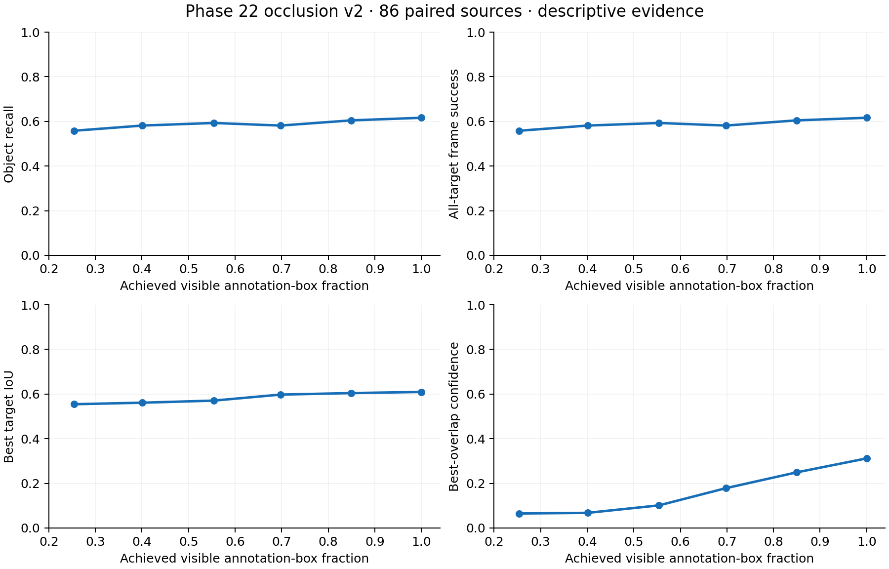

# Phase 22 Controlled Occlusion Sweep v2 — Historical Q95 Representation

**COMPLETE — Q95 CLEAN GATE PASS**. This is a separate versioned follow-up. The original raw-source sweep remains **INCONCLUSIVE — CLEAN GATE FAILED — NO TREATMENT INFERENCE RUN**.

Recovery source: `codex/all-work-publication-2026-09-30`, commit `f090da03d20b2425c5addccb4d19117c8991bcc1`. Only its ten research files were imported; no old UI branch merge/cherry-pick.

Original protocol SHA: `e169e16ea40ca44ee60ca8b6074d054c33aeeaf1a3d24e55fa4cd3b8581882d7`. Recovered publication runner SHA: `939b286418c66fa7a8ab39c6dc981b43324b5804f21f026ff1090a84e95c79a4`. Both 516-case historical manifests reproduce exactly, without detector inference. The original full implementation/runtime receipt remains lost; this does not claim that the publication runner is byte-identical to the lost earlier runner.

V2 protocol SHA: `7d9229050192a500c42daf1d05b4afad8cdefd41f9f408d203248d14635a9600`. Separate pre-inference freeze commit: `6a8623cbeb54951f43b8ca65293598e7c41a474e`. Stage A remains unchanged at `9dd9293` and `3373aa8`.

The chain is original JPEG → RGB decode → historical JPEG Q95 canonicalization → Q95 decode → original centered gray mask → lossless PNG nonzero treatment. Zero dose retains canonical Q95 JPEG bytes.

Fresh aggregate clean gate: precision 0.7959713659654185, recall 0.38372093023255816, mAP50 0.42662686781189296, mAP50–95 0.2723431563204893. Recall and mAP50 differ from the repository CSV reference only by 5.55e−17 floating-point roundtrip and pass tolerance 0.001. All four metrics match the Stage A Q95 and historical bundle values exactly.

## Descriptive outcomes

| Requested occlusion | Mean achieved box visibility | Recall / frame success | FP/frame | Mean best IoU | Mean best-overlap confidence |
| ---: | ---: | ---: | ---: | ---: | ---: |
| 0% | 100.00% | 53/86 (61.63%) | 275.30 | 0.609450 | 0.311791 |
| 15% | 84.95% | 52/86 (60.47%) | 279.17 | 0.604315 | 0.249208 |
| 30% | 69.75% | 50/86 (58.14%) | 282.09 | 0.597575 | 0.178307 |
| 45% | 55.39% | 51/86 (59.30%) | 283.57 | 0.570621 | 0.101309 |
| 60% | 40.07% | 50/86 (58.14%) | 283.14 | 0.561267 | 0.067868 |
| 75% | 25.39% | 48/86 (55.81%) | 281.20 | 0.554449 | 0.065008 |

Recall declines by 5.81 percentage points from zero to 75% nominal dose, but the curve is not strictly monotonic (50 targets at 30%, 51 at 45%). Mean target IoU decreases by 0.0550; best-overlap confidence decreases by 0.2468. Zero-to-maximum paired transitions: 47 both pass, 6 regressed, 1 recovered, 32 both fail. All 86 sources are retained at every dose.

There is one annotated target per protected frame, so object recall and all-target frame success are numerically equal in this population. Frame success does not require zero false positives. FP/frame remains very high at the preregistered 0.001 confidence floor.

V2 follows the recovered original runner’s per-dose `model.predict` path. Stage A exported boxes from `model.val`. V2’s zero-dose frame success is 53/86; Stage A’s saved Q95 validation-pass frame success is 51/86. These are different execution passes (with their original preprocessing defaults), not additional representation transitions. The official aggregate gate is the fresh validation pass. Do not compare these floor-level counts as if the prediction paths were identical.

**Threshold finding: NOT APPLICABLE.** The authenticated original protocol contains no preregistered threshold criterion. No threshold, confidence cutoff, exclusion or dose was chosen after observing the curve.

## Statistical and evidence boundary

The statistical unit is 86 source frames paired across six doses, from two temporally dependent videos. The 516 cases are not independent samples. The original plan is descriptive; no significance tests, population confidence intervals or random resampling are reported. No seed is applicable to this deterministic analysis.

Visibility refers to annotation-box pixels, not physical visible pad surface. Matched-TP IoU/confidence are labeled survivor-only in target and dose tables. Best-overlap confidence is a model score, not landing-safety probability. These previously inspected frames and one centered opaque synthetic intervention do not establish flight safety or independent-session generalization. The separate v2 runtime records CPU-built Torch/OpenCV versions from Stage A; it does not reconstruct the lost historical full runtime.

## Verification

422 full-suite tests passed. Offline replay checked 516 frames, 516 target outcomes and 145,169 saved predictions, including all raw matching decisions, source-frame paired changes and adjacent-dose transitions. Both complete original geometry manifests match their recorded SHA-256 values. Stage A replay and nine historical table/method hashes plus two generated site snapshots passed. Seven browser state tests passed.

See `verification.json`, `artifact_replay.json`, `run_outcome.json`, all CSV tables and `prediction_boxes.csv.gz`. The preflight `run_manifest.json` is immutable; `run_outcome.json` is the authoritative final status. Reproduction commands and recovery limits are in `docs/phase22_occlusion_v2.md`.
